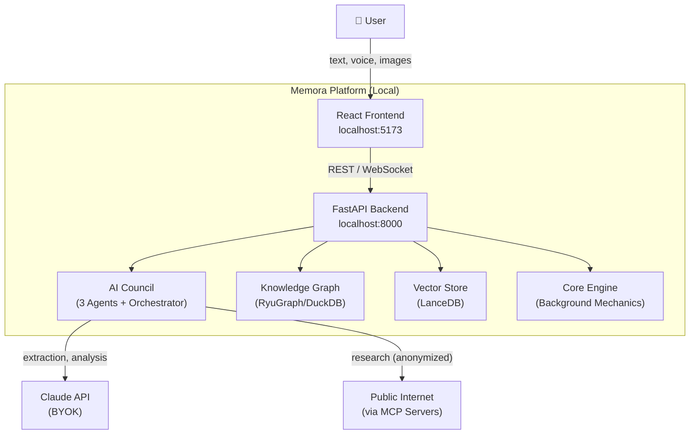
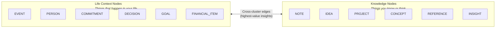
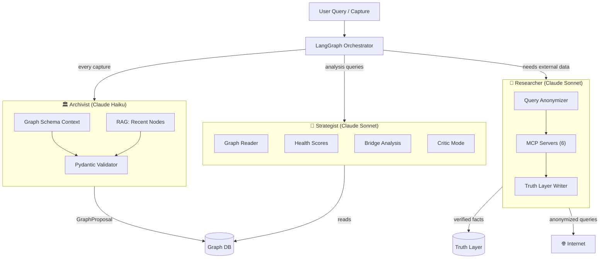
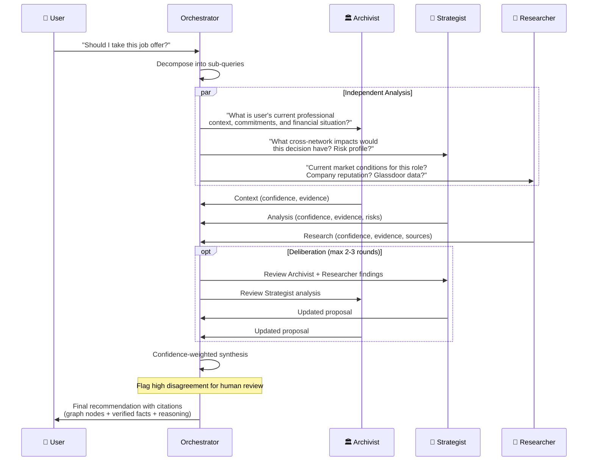
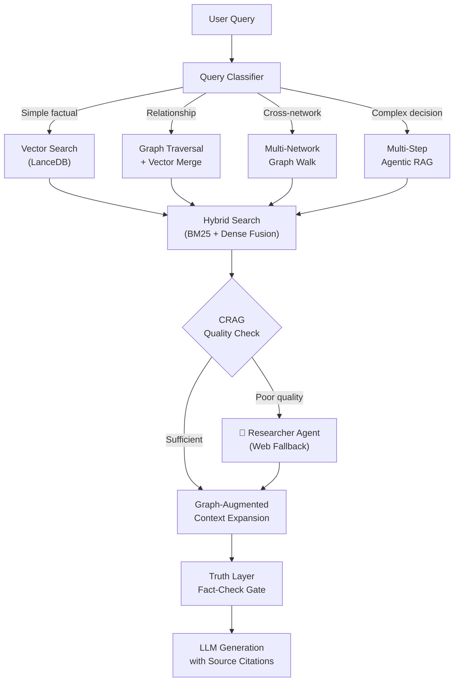
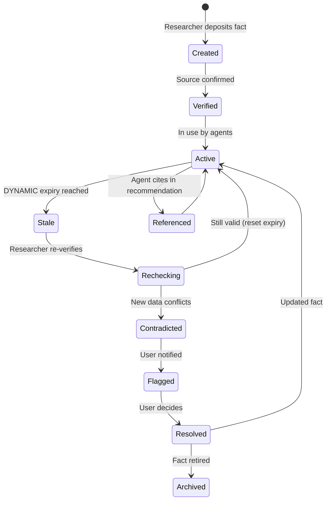
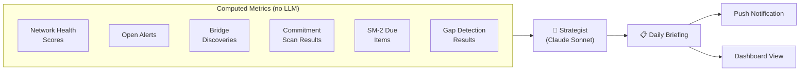
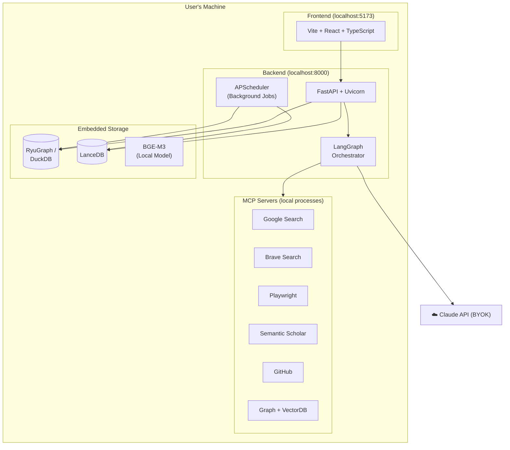
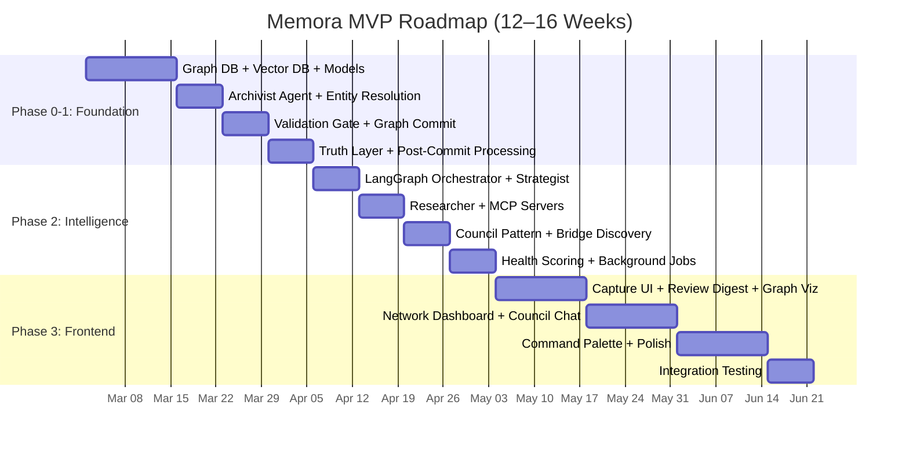

# Memora — System Architecture Document

> **Version:** 1.0
> **Date:** February 27, 2026
> **Status:** Technical Reference
> **Audience:** Engineering Team & Architecture Review
> **Classification:** CONFIDENTIAL — Internal Distribution Only

---

## Table of Contents

- [1. System Overview](#1-system-overview)
  - [1.1 What Memora Is](#11-what-memora-is)
  - [1.2 Core Thesis](#12-core-thesis)
  - [1.3 High-Level System Context](#13-high-level-system-context)
  - [1.4 Layered Architecture](#14-layered-architecture)
  - [1.5 Design Principles](#15-design-principles)
- [2. Input-to-Graph Pipeline](#2-input-to-graph-pipeline)
  - [2.1 Pipeline Overview](#21-pipeline-overview)
  - [2.2 Stage 1: Raw Input Capture](#22-stage-1-raw-input-capture)
  - [2.3 Stage 2: Preprocessing](#23-stage-2-preprocessing)
  - [2.4 Stage 3: Archivist Extraction](#24-stage-3-archivist-extraction)
  - [2.5 Stage 4: Entity Resolution](#25-stage-4-entity-resolution)
  - [2.6 Stage 5: Graph Proposal Assembly](#26-stage-5-graph-proposal-assembly)
  - [2.7 Stage 6: Validation Gate](#27-stage-6-validation-gate)
  - [2.8 Stage 7: Human Review / Auto-Approve](#28-stage-7-human-review--auto-approve)
  - [2.9 Stage 8: Graph Commit](#29-stage-8-graph-commit)
  - [2.10 Stage 9: Post-Commit Processing](#210-stage-9-post-commit-processing)
- [3. Graph Ontology & Data Models](#3-graph-ontology--data-models)
  - [3.1 Node Type Taxonomy](#31-node-type-taxonomy)
  - [3.2 Shared Node Properties](#32-shared-node-properties)
  - [3.3 Node-Type-Specific Properties](#33-node-type-specific-properties)
  - [3.4 Edge Types & Categories](#34-edge-types--categories)
  - [3.5 Edge Properties Schema](#35-edge-properties-schema)
  - [3.6 Context Networks](#36-context-networks)
- [4. Database Schemas](#4-database-schemas)
  - [4.1 Graph Database (RyuGraph / DuckDB)](#41-graph-database-ryugraph--duckdb)
  - [4.2 Vector Database (LanceDB)](#42-vector-database-lancedb)
  - [4.3 Truth Layer Tables](#43-truth-layer-tables)
- [5. AI Agent System Design](#5-ai-agent-system-design)
  - [5.1 Agent Architecture Overview](#51-agent-architecture-overview)
  - [5.2 Agent 1: The Archivist (Graph Writer)](#52-agent-1-the-archivist-graph-writer)
  - [5.3 Agent 2: The Strategist (Graph Reader + Analyst)](#53-agent-2-the-strategist-graph-reader--analyst)
  - [5.4 Agent 3: The Researcher (Internet Bridge)](#54-agent-3-the-researcher-internet-bridge)
  - [5.5 The Orchestrator: Agent Coordination](#55-the-orchestrator-agent-coordination)
  - [5.6 Council Decision Pattern (High-Stakes Queries)](#56-council-decision-pattern-high-stakes-queries)
  - [5.7 LLM Routing & Cost Model](#57-llm-routing--cost-model)
- [6. Adaptive RAG Pipeline](#6-adaptive-rag-pipeline)
  - [6.1 Query Classification & Routing](#61-query-classification--routing)
  - [6.2 RAG Pipeline Flow](#62-rag-pipeline-flow)
  - [6.3 CRAG (Corrective RAG)](#63-crag-corrective-rag)
  - [6.4 Graph-Augmented Context Expansion](#64-graph-augmented-context-expansion)
  - [6.5 Truth Layer Fact-Check Gate](#65-truth-layer-fact-check-gate)
- [7. Truth Layer: Verified Fact Store](#7-truth-layer-verified-fact-store)
  - [7.1 Source Confidence Hierarchy](#71-source-confidence-hierarchy)
  - [7.2 Fact Lifecycle](#72-fact-lifecycle)
  - [7.3 Fact-Check Gate Integration](#73-fact-check-gate-integration)
- [8. Background Mechanics: The Living Graph Engine](#8-background-mechanics-the-living-graph-engine)
  - [8.1 Job Schedule Overview](#81-job-schedule-overview)
  - [8.2 Decay Scoring](#82-decay-scoring)
  - [8.3 Bridge Discovery](#83-bridge-discovery)
  - [8.4 Network Health Scoring](#84-network-health-scoring)
  - [8.5 Spaced Repetition (SM-2)](#85-spaced-repetition-sm-2)
  - [8.6 Gap Detection](#86-gap-detection)
- [9. Notification & Briefing System](#9-notification--briefing-system)
  - [9.1 Notification Triggers](#91-notification-triggers)
  - [9.2 Daily Briefing Structure](#92-daily-briefing-structure)
  - [9.3 Briefing Generation Flow](#93-briefing-generation-flow)
- [10. API Specification](#10-api-specification)
  - [10.1 API Overview](#101-api-overview)
  - [10.2 Core Endpoints](#102-core-endpoints)
  - [10.3 WebSocket & SSE](#103-websocket--sse)
  - [10.4 Request/Response Examples](#104-requestresponse-examples)
- [11. Frontend Architecture](#11-frontend-architecture)
  - [11.1 Technology Stack](#111-technology-stack)
  - [11.2 Key Views](#112-key-views)
  - [11.3 State Management](#113-state-management)
  - [11.4 Real-Time Communication](#114-real-time-communication)
- [12. Deployment Architecture](#12-deployment-architecture)
  - [12.1 Local-First Architecture](#121-local-first-architecture)
  - [12.2 File System Layout](#122-file-system-layout)
  - [12.3 Infrastructure Cost](#123-infrastructure-cost)
- [13. Project Structure](#13-project-structure)
- [14. Implementation Roadmap](#14-implementation-roadmap)
  - [14.1 Phase 0–1: Foundation (Weeks 1–5)](#141-phase-01-foundation-weeks-15)
  - [14.2 Phase 2: Intelligence (Weeks 6–9)](#142-phase-2-intelligence-weeks-69)
  - [14.3 Phase 3: Frontend (Weeks 10–16)](#143-phase-3-frontend-weeks-1016)
  - [14.4 Gantt Chart](#144-gantt-chart)
- [15. Success Metrics](#15-success-metrics)
- [16. Risk Assessment](#16-risk-assessment)
- [17. Open Questions & Decisions](#17-open-questions--decisions)
- [Appendix A: Complete Node Type Property Reference](#appendix-a-complete-node-type-property-reference)
- [Appendix B: Complete Edge Type Reference](#appendix-b-complete-edge-type-reference)
- [Appendix C: Archivist System Prompt Template](#appendix-c-archivist-system-prompt-template)
- [Appendix D: Glossary](#appendix-d-glossary)

---

## 1. System Overview

### 1.1 What Memora Is

Memora is a **local-first decision intelligence platform** that turns everything a person captures — text, voice, images — into a structured, interconnected knowledge graph. Three specialized AI agents continuously reason over this living graph to surface hidden connections, flag neglected commitments, recommend optimal actions, and deliver real-time situational awareness that no human memory can maintain.

**This is not a note-taking app.** Context capture is the input; **better high-stakes decisions, proactive recommendations, and strategic foresight** are the output.

### 1.2 Core Thesis

Memora is architecturally a **Personal Palantir**. Palantir ingests raw data from dozens of sources, resolves entities, builds an ontology graph, deploys AI agents, and surfaces hidden connections at enterprise/government scale. Memora follows the identical pipeline applied to a single human life — the "nation" being surveilled is your own life, and the "intelligence analyst" is you.

### 1.3 High-Level System Context



### 1.4 Layered Architecture

```
┌─────────────────────────────────────────────────────────────────────────┐
│  PRESENTATION    Vite + React + TypeScript │ Sigma.js │ TipTap │       │
│                  Tailwind + Zustand                                     │
├─────────────────────────────────────────────────────────────────────────┤
│  API             FastAPI + Uvicorn │ WebSocket + SSE │ Python 3.12+    │
├─────────────────────────────────────────────────────────────────────────┤
│  INTELLIGENCE    LangGraph Orchestrator │ Claude Agent SDK │           │
│                  6 MCP Servers │ Claude API (BYOK)                      │
├─────────────────────────────────────────────────────────────────────────┤
│  CORE ENGINE     APScheduler │ Decay/SM-2 │ Health Scoring │           │
│                  Bridge Discovery │ Truth Layer                         │
├─────────────────────────────────────────────────────────────────────────┤
│  INFRASTRUCTURE  RyuGraph / DuckDB │ LanceDB │ BGE-M3 (local)         │
└─────────────────────────────────────────────────────────────────────────┘
```

> [!IMPORTANT]
> The Core Engine layer is entirely **LLM-independent** — deterministic algorithms that would function even if the AI layer were removed. This is the primary anti-wrapper defense.

### 1.5 Design Principles

**UX Principles:**

1. **Graph as infrastructure, not interface** — the graph powers everything behind the scenes. Multiple views: graph, outline, timeline, table, network dashboard
2. **Local graph > global graph** — default to neighborhood of current node. Global graphs become hairballs past a few hundred nodes
3. **Command palette as primary navigation** — Cmd+K is fastest. Keyboard-first, mouse-friendly
4. **Capture-first, structure-later** — every entry goes to the Archivist. You just talk naturally
5. **Progressive disclosure of AI** — show the answer first. Collapsible sections reveal reasoning, sources, agent deliberation
6. **Decay and resurfacing** — unvisited knowledge fades. Revisited knowledge strengthens. SM-2 spaced repetition on all nodes
7. **Zero-friction capture** — capture action < 2 seconds. Share sheet, voice, screenshot, global shortcut
8. **Never show a blank page** — always suggest, pre-populate, show context
9. **Human-in-the-loop by default** — the system proposes, you decide

**Anti-Wrapper Rules:**

1. Every AI output must cite **graph nodes AND verified facts** — ChatGPT cannot do this
2. The graph is the product, the LLM is the interface — remove the LLM and the graph + Truth Layer + mechanics remain a queryable life database
3. Custom algorithms > LLM prompts — bridge discovery = embedding similarity + graph traversal; health = weighted metrics; decay = exponential functions; spaced repetition = SM-2. All deterministic and reproducible
4. Progressive disclosure of AI reasoning — answer first, then collapsible: agents, confidence, graph paths, verified facts, disagreements
5. Never let the LLM be the sole source of intelligence — every insight must be verifiable by graph query + Truth Layer lookup

---

## 2. Input-to-Graph Pipeline

### 2.1 Pipeline Overview

Every piece of information traverses all nine stages before becoming committed knowledge in the graph. The pipeline mirrors Palantir Foundry's data integration: raw ingestion → transformation → entity resolution → ontology mapping → governance gate → commit.

```mermaid
flowchart LR
    S1["Stage 1<br/>Raw Input<br/><i>text / voice / image</i>"]
    S2["Stage 2<br/>Preprocessing<br/><i>transcription, OCR,<br/>normalization</i>"]
    S3["Stage 3<br/>Archivist Extraction<br/><i>LLM + schema</i>"]
    S4["Stage 4<br/>Entity Resolution<br/><i>dedup + merge</i>"]
    S5["Stage 5<br/>Graph Proposal<br/><i>structured diff</i>"]
    S6["Stage 6<br/>Validation Gate<br/><i>confidence routing</i>"]
    S7["Stage 7<br/>Human Review /<br/>Auto-Approve"]
    S8["Stage 8<br/>Graph Commit<br/><i>atomic write</i>"]
    S9["Stage 9<br/>Post-Commit<br/><i>embeddings, bridges,<br/>network assignment</i>"]

    S1 --> S2 --> S3 --> S4 --> S5 --> S6 --> S7 --> S8 --> S9
    S4 -.->|"rejection / feedback"| S3
```



### 2.2 Stage 1: Raw Input Capture

**Purpose:** Accept user input through three modalities.
**LLM required:** No

| Input Type | Format | How It Enters |
|---|---|---|
| Text (typed) | Raw string | Capture UI text box, command palette, global shortcut |
| Voice memo | Audio → text | Whisper transcription (local or API) to text |
| Screenshot | Image → text | OCR + LLM visual understanding to structured text |
| Photo (whiteboard, document) | Image → text | SigLIP 2 (400M) lazy-loaded for image captures |

**Design constraint:** Capture action must complete in **< 2 seconds**. Every entry is timestamped, tagged with input modality, and assigned a unique content hash (SHA-256) for deduplication.

### 2.3 Stage 2: Preprocessing

**Purpose:** Deterministic normalization before the Archivist sees the input.
**LLM required:** No — entirely deterministic. This ensures reproducibility and keeps costs at zero for this stage.

1. **Transcription** (voice only): Whisper model converts audio to text with speaker diarization
2. **OCR + Visual Understanding** (images only): Extract text via OCR; pass image + extracted text to LLM for structured interpretation ("This is a receipt from Starbucks for $5.40 on Feb 20")
3. **Text Normalization**: Standardize dates ("next Tuesday" → `2026-03-03`), currency ("5 bucks" → `$5.00`), names ("Dr. Smith" → normalized form)
4. **Language Detection**: BGE-M3 supports 100+ languages; detect language for proper tokenization
5. **Deduplication Check**: Content hash compared against recent captures to prevent duplicate processing

### 2.4 Stage 3: Archivist Extraction

**Purpose:** Transform unstructured natural language into structured graph operations.
**LLM required:** Yes — this is the first and highest-frequency LLM invocation.

**Agent:** The Archivist (Claude Haiku)
**Cost optimization:** Prompt caching reduces costs by 60–70%. The system prompt (~2,000–4,000 tokens: schema + rules + network definitions) is near-identical across 95%+ of calls. Only the RAG context window and the user's actual capture change.

**What the Archivist does per capture:**

1. **Entity Extraction**: Identify all entities — people, organizations, places, events, dates, financial amounts, commitments, decisions, goals, ideas, concepts
2. **Relationship Extraction**: Identify how entities relate — "Sam *promised* to introduce me to *his investor*" yields: `PERSON(Sam) –[PROMISED]→ COMMITMENT(introduction) –[INVOLVES]→ PERSON(investor)`
3. **Attribute Extraction**: Pull properties for each entity — roles, amounts, dates, sentiments, confidence levels
4. **Network Classification**: Assign each entity and relationship to one or more of the seven context networks
5. **Temporal Anchoring**: Attach temporal metadata — when did this happen? When is it due? Past, present, or future?
6. **Confidence Scoring**: Rate extraction confidence (0–1) for each proposed node and edge

**Constrained Output via Pydantic Schemas:**

The Archivist does **not** return free-form text. It returns structured JSON validated against strict Pydantic schemas. This prevents hallucinated graph structure.

```python
from pydantic import BaseModel
from datetime import datetime
from enum import Enum


class NodeType(str, Enum):
    # Life Context Nodes
    EVENT = "EVENT"
    PERSON = "PERSON"
    COMMITMENT = "COMMITMENT"
    DECISION = "DECISION"
    GOAL = "GOAL"
    FINANCIAL_ITEM = "FINANCIAL_ITEM"
    # Knowledge Nodes
    NOTE = "NOTE"
    IDEA = "IDEA"
    PROJECT = "PROJECT"
    CONCEPT = "CONCEPT"
    REFERENCE = "REFERENCE"
    INSIGHT = "INSIGHT"


class EdgeCategory(str, Enum):
    STRUCTURAL = "STRUCTURAL"
    ASSOCIATIVE = "ASSOCIATIVE"
    PROVENANCE = "PROVENANCE"
    TEMPORAL = "TEMPORAL"
    PERSONAL = "PERSONAL"
    SOCIAL = "SOCIAL"
    NETWORK = "NETWORK"


class NetworkType(str, Enum):
    ACADEMIC = "ACADEMIC"
    PROFESSIONAL = "PROFESSIONAL"
    FINANCIAL = "FINANCIAL"
    HEALTH = "HEALTH"
    PERSONAL_GROWTH = "PERSONAL_GROWTH"
    SOCIAL = "SOCIAL"
    VENTURES = "VENTURES"


class TemporalAnchor(BaseModel):
    """When does this entity apply in time?"""
    occurred_at: datetime | None = None
    due_at: datetime | None = None
    temporal_type: str  # "past", "present", "future", "recurring"


class NodeProposal(BaseModel):
    """A proposed new node in the knowledge graph."""
    temp_id: str                        # temporary ID for edge references
    node_type: NodeType
    title: str                          # human-readable name
    content: str                        # full extracted content
    properties: dict                    # type-specific properties
    confidence: float                   # extraction confidence 0-1
    networks: list[NetworkType]         # which context networks
    temporal: TemporalAnchor | None     # when does this apply


class NodeUpdate(BaseModel):
    """An update to an existing node."""
    node_id: str                        # existing graph node ID
    updates: dict                       # properties to update
    confidence: float
    reason: str                         # why this update


class EdgeProposal(BaseModel):
    """A proposed relationship between two nodes."""
    source_id: str                      # node temp_id or existing graph ID
    target_id: str
    edge_type: str                      # 30+ subtypes
    edge_category: EdgeCategory         # 7 categories
    properties: dict
    confidence: float
    bidirectional: bool


class EdgeUpdate(BaseModel):
    """An update to an existing edge."""
    edge_id: str
    updates: dict
    confidence: float


class NetworkAssignment(BaseModel):
    """Assign a node to a context network."""
    node_id: str                        # temp_id or existing
    network: NetworkType
    confidence: float


class GraphProposal(BaseModel):
    """Atomic set of graph changes proposed by the Archivist."""
    source_capture_id: str
    timestamp: datetime
    confidence: float                   # 0.0 - 1.0 overall

    nodes_to_create: list[NodeProposal]
    nodes_to_update: list[NodeUpdate]
    edges_to_create: list[EdgeProposal]
    edges_to_update: list[EdgeUpdate]
    network_assignments: list[NetworkAssignment]
```

**Archivist System Prompt Architecture (5 components):**

1. **The complete graph schema**: All node types, edge types, property definitions, valid combinations
2. **Existing entity context** (via RAG): Recent nodes that might be referenced or updated — preventing duplicate creation
3. **Network definitions**: What each context network represents, with classification examples
4. **Extraction rules**: "If a person is mentioned by first name only and a matching PERSON node exists, reference the existing node rather than creating a new one"
5. **Clarification protocol**: If the input is ambiguous, the Archivist can request clarification from the user instead of guessing

### 2.5 Stage 4: Entity Resolution

**Purpose:** Determine whether a newly extracted entity refers to an **existing** node or is genuinely new.
**LLM required:** Partially — LLM adjudication is one of six signals.

This is the single hardest problem in the pipeline.

**Multi-Signal Resolution Strategy:**

| Signal | Weight | Details |
|---|---|---|
| Exact name match | 0.95 | Normalized canonical name comparison |
| Embedding similarity (>0.92) | 0.80 | BGE-M3 dense vector cosine similarity |
| Same context network | 0.15 | Bonus if in overlapping networks |
| Temporal proximity | 0.10 | Mentioned within 7-day window of existing node |
| Shared relationships | 0.20 | Connected to same PERSON/EVENT nodes |
| LLM adjudication | 0.90 | Archivist explicitly asked "same entity?" |

**Ambiguity flag:** If confidence is between 0.6–0.85, flag for human review rather than auto-resolving.

**Resolution Outcomes:**

- **Merge**: Two nodes confirmed as same entity → merge properties, keep all edges, log the merge event
- **Create**: No match found → create new node with full provenance
- **Link**: Entities are related but distinct → create an edge (e.g., "Sam (investor)" and "Sam (friend)" might be different people)
- **Defer**: Ambiguous case → flag for human review with both candidates presented

### 2.6 Stage 5: Graph Proposal Assembly

**Purpose:** Assemble a complete, atomic **Graph Proposal** — a structured diff of all changes.
**LLM required:** No

> [!IMPORTANT]
> **Nothing enters the graph without a proposal.** The graph proposal is the fundamental unit of change in Memora. It is analogous to a database transaction or a git commit — an atomic, reviewable, reversible set of changes.

A graph proposal contains:

- **New nodes** to create (with all properties, confidence scores, network assignments)
- **Existing nodes** to update (property changes, confidence adjustments, new network memberships)
- **New edges** to create (typed relationships between new and/or existing nodes)
- **Existing edges** to update (relationship changes, weight adjustments)
- **Provenance chain**: which capture triggered this proposal, which agent created it, what extraction rules were applied
- **Overall confidence score**: weighted average of all individual confidences
- **Human-readable summary**: natural language description ("Adding person Sam Chen, linking to existing Project Alpha, creating commitment: intro to investor by March 5")

### 2.7 Stage 6: Validation Gate

**Purpose:** Route proposals based on confidence and impact.
**LLM required:** No

| Route | Trigger | UX |
|---|---|---|
| **Auto-approve** | confidence ≥ 0.85 | Silently committed; shown in daily digest |
| **Daily review digest** | All auto-committed | Review what was committed, correct mistakes |
| **Explicit confirm** | High-impact changes (deletes, merges, contradictions) | Presented immediately for user decision |

> [!NOTE]
> **Decision fatigue mitigation:** Research shows quality degrades after ~35 micro-decisions per day (Baumeister et al.). Auto-approve at ≥0.85 confidence means most routine captures flow through silently, while the daily review digest catches errors. Target: **< 5% of auto-approved changes require user correction**.

### 2.8 Stage 7: Human Review / Auto-Approve

**Purpose:** Final gate before committing to the graph.

- **Auto-approved proposals**: Committed immediately, logged in daily review digest for retrospective correction
- **Digest-routed proposals**: Batched into the morning review — user sees a list of proposed changes and can approve, edit, or reject each one
- **Explicit-confirm proposals**: Presented immediately with full context — "The Archivist wants to merge Person(Sam) with Person(Samuel Chen). Here are both profiles. Approve?"

### 2.9 Stage 8: Graph Commit

**Purpose:** Atomically commit the approved proposal to the knowledge graph.
**LLM required:** No

1. **Transaction begin**: All node/edge creations and updates wrapped in a single atomic transaction
2. **Node creation/update**: Nodes written to RyuGraph/DuckDB with all properties, timestamps, and approval status
3. **Edge creation/update**: Typed edges created between nodes with provenance metadata
4. **Provenance logging**: Full audit trail — which capture, which agent, which extraction rules, human approval status
5. **Transaction commit**: All-or-nothing — if any step fails, the entire proposal is rolled back

### 2.10 Stage 9: Post-Commit Processing

**Purpose:** Asynchronous enrichment after a successful commit.
**LLM required:** Partially (bridge discovery daily batch uses 1 LLM call)

1. **Embedding generation**: BGE-M3 generates dense (Float[1024]) + sparse embeddings for all new/updated nodes → written to LanceDB
2. **Bridge discovery** (incremental): New node's embedding compared against nodes in *other* context networks via HNSW index lookup (O(log N), ~1–5ms at 10K nodes). High-similarity cross-network pairs flagged as potential bridges
3. **Network health recalculation**: If the new data affects commitment completion rates or alert counts, network health status is updated
4. **Notification triggers**: Check if the new data triggers any notification rules (deadline approaching, relationship decay, goal drift)
5. **Truth Layer cross-reference**: If the committed data contains claims that intersect with verified facts, flag any contradictions

---

## 3. Graph Ontology & Data Models

### 3.1 Node Type Taxonomy

Memora's graph uses **12 typed node categories** organized into two clusters:



### 3.2 Shared Node Properties

Every node in the graph carries a standard set of properties — the metadata that enables search, decay, confidence tracking, and provenance:

| Property | Type | Purpose | Constraints |
|---|---|---|---|
| `id` | UUID | Unique identifier, immutable after creation | Primary key, auto-generated |
| `content_hash` | SHA-256 | Deduplication key — identical content = identical hash | Unique |
| `created_at` | Timestamp | When this node was first created | Auto-set |
| `updated_at` | Timestamp | Last modification timestamp | Auto-updated |
| `embedding` | Float[1024] | BGE-M3 dense vector for semantic search | Generated post-commit |
| `sparse_embedding` | Sparse vector | BGE-M3 BM25-compatible sparse representation | Generated post-commit |
| `confidence` | Float [0–1] | Extraction confidence from the Archivist | Required |
| `networks` | List[NetworkType] | Which context networks this node belongs to | At least one |
| `human_approved` | Boolean | Whether a human has reviewed and approved this node | Default: false |
| `proposed_by` | AgentID | Which agent proposed this node (Archivist, Researcher, etc.) | Required |
| `source_capture_id` | UUID | Link back to the original raw capture | Foreign key |
| `access_count` | Integer | How many times this node has been accessed (for decay) | Default: 0 |
| `last_accessed` | Timestamp | Last time this node was referenced (for decay) | Nullable |
| `decay_score` | Float | Current decay score (exponential decay function) | Default: 1.0 |
| `review_date` | Timestamp | When this node is due for spaced repetition review | Nullable |
| `tags` | List[String] | User-defined and auto-generated tags | Optional |

### 3.3 Node-Type-Specific Properties

**Life Context Nodes:**

| Node Type | Type-Specific Properties |
|---|---|
| `EVENT` | `event_date`, `location`, `participants: list[str]`, `event_type`, `duration`, `sentiment` |
| `PERSON` | `name`, `role`, `relationship_to_user`, `contact_info: dict`, `organization`, `last_interaction` |
| `COMMITMENT` | `due_date`, `status: enum(open, completed, overdue, cancelled)`, `committed_by`, `committed_to`, `priority` |
| `DECISION` | `decision_date`, `options_considered: list[str]`, `chosen_option`, `rationale`, `outcome`, `reversible: bool` |
| `GOAL` | `target_date`, `progress: float`, `milestones: list[dict]`, `status: enum(active, paused, achieved, abandoned)`, `priority` |
| `FINANCIAL_ITEM` | `amount: float`, `currency: str`, `direction: enum(inflow, outflow)`, `category`, `recurring: bool`, `counterparty` |

**Knowledge Nodes:**

| Node Type | Type-Specific Properties |
|---|---|
| `NOTE` | `source_context`, `note_type: enum(observation, reflection, summary, quote)` |
| `IDEA` | `maturity: enum(seed, developing, mature, archived)`, `domain`, `potential_impact` |
| `PROJECT` | `status: enum(active, paused, completed, abandoned)`, `start_date`, `target_date`, `team: list[str]`, `deliverables: list[str]` |
| `CONCEPT` | `definition`, `domain`, `related_concepts: list[str]`, `complexity_level` |
| `REFERENCE` | `url`, `author`, `publication_date`, `source_type`, `citation`, `archived: bool` |
| `INSIGHT` | `derived_from: list[str]`, `actionable: bool`, `cross_network: bool`, `strength: float` |

### 3.4 Edge Types & Categories

Edges are typed across **seven categories**, each serving a different analytical purpose:

| Category | Example Subtypes | What It Captures |
|---|---|---|
| **STRUCTURAL** | `PART_OF`, `CONTAINS`, `SUBTASK_OF` | Hierarchy and composition |
| **ASSOCIATIVE** | `RELATED_TO`, `INSPIRED_BY`, `CONTRADICTS`, `SIMILAR_TO`, `COMPLEMENTS` | Semantic relationships |
| **PROVENANCE** | `DERIVED_FROM`, `VERIFIED_BY`, `SOURCE_OF`, `EXTRACTED_FROM` | Where information came from |
| **TEMPORAL** | `PRECEDED_BY`, `EVOLVED_INTO`, `TRIGGERED`, `CONCURRENT_WITH` | Time-ordered causation |
| **PERSONAL** | `COMMITTED_TO`, `DECIDED`, `FELT_ABOUT`, `RESPONSIBLE_FOR` | Personal stakes and emotions |
| **SOCIAL** | `KNOWS`, `INTRODUCED_BY`, `OWES_FAVOR`, `COLLABORATES_WITH`, `REPORTS_TO` | People and social dynamics |
| **NETWORK** | `BRIDGES`, `MEMBER_OF`, `IMPACTS`, `CORRELATES_WITH` | Cross-network connections |

> [!NOTE]
> **NETWORK edges (gold bridges)** represent the highest-value intelligence. These are the cross-domain connections invisible to any single-domain tool. Example: a `BRIDGES` edge connecting a Health network stress node to a Professional network overcommitment node.

### 3.5 Edge Properties Schema

| Property | Type | Purpose |
|---|---|---|
| `id` | UUID | Unique edge identifier |
| `source_id` | UUID | Source node reference |
| `target_id` | UUID | Target node reference |
| `edge_type` | String | Specific subtype (e.g., `EVOLVED_INTO`) |
| `edge_category` | EdgeCategory | One of 7 categories |
| `confidence` | Float [0–1] | Extraction confidence |
| `weight` | Float | Relationship strength (used by algorithms) |
| `bidirectional` | Boolean | Whether the relationship goes both ways |
| `properties` | JSON | Edge-specific metadata |
| `created_at` | Timestamp | Creation time |
| `updated_at` | Timestamp | Last modification |

### 3.6 Context Networks

The graph is organized into **seven interconnected context networks** — living subgraphs that each track a domain of the user's life:

| Network | What It Tracks | Example Entities | Health Indicators |
|---|---|---|---|
| **Academic** | Courses, grades, research, study commitments | Papers, professors, deadlines, concepts | Assignment completion, study consistency |
| **Professional** | Work projects, clients, colleagues, deliverables | Meetings, deliverables, career goals | Commitment fulfillment, project velocity |
| **Financial** | Transactions, budgets, investments | Invoices, subscriptions, loans | Budget adherence, overdue payments |
| **Health** | Exercise, sleep, stress, medical appointments | Symptoms, medications, habits | Routine consistency, stress trends |
| **Personal Growth** | Learning goals, skills, habits, self-improvement | Books, courses, habits, reflections | Goal progress, learning streak |
| **Social** | Friends, family, social events, relationship health | People, gatherings, favors owed | Interaction recency, relationship decay |
| **Ventures** | Side projects, entrepreneurial activities, business ideas | Startup ideas, MVPs, investors | Milestone progress, runway |

**Critical design point:** A single node can belong to **multiple networks**. "Sam" might be in both Professional and Social. A COMMITMENT to "submit the proposal" might be in both Academic and Ventures. These multi-membership nodes are the natural bridge points where cross-domain intelligence emerges.

**Network Health Status:**

| Status | Meaning |
|---|---|
| 🟢 **On Track** | Commitments met, no overdue items, recent engagement |
| 🟡 **Needs Attention** | Some open alerts, declining momentum, stale commitments |
| 🔴 **Falling Behind** | Multiple overdue items, no recent input, high alert count |

Health is computed from **commitment completion rate** (actionable), **alert ratio** (urgency), and **staleness flags** (only triggered when commitments exist but haven't been updated). Momentum is internal-only as a directional arrow (up/stable/down) — never shown as a percentage.

---

## 4. Database Schemas

### 4.1 Graph Database (RyuGraph / DuckDB)

Primary graph storage using RyuGraph (Kuzu fork) with DuckDB as fallback. Both are embedded — zero infrastructure cost.

```sql
-- ============================================================
-- CAPTURES: Raw user input storage
-- ============================================================
CREATE TABLE captures (
    id              UUID PRIMARY KEY DEFAULT gen_random_uuid(),
    modality        VARCHAR NOT NULL,               -- 'text', 'voice', 'image'
    raw_content     TEXT NOT NULL,
    processed_content TEXT,
    content_hash    VARCHAR(64) NOT NULL UNIQUE,     -- SHA-256 dedup
    language        VARCHAR(10),                     -- detected language code
    metadata        JSON,                            -- modality-specific metadata
    created_at      TIMESTAMP DEFAULT CURRENT_TIMESTAMP
);


-- ============================================================
-- NODES: Knowledge graph nodes
-- ============================================================
CREATE TABLE nodes (
    id              UUID PRIMARY KEY DEFAULT gen_random_uuid(),
    node_type       VARCHAR NOT NULL,                -- NodeType enum
    title           VARCHAR NOT NULL,
    content         TEXT,
    content_hash    VARCHAR(64) NOT NULL,
    properties      JSON,                            -- type-specific properties
    confidence      FLOAT CHECK (confidence >= 0 AND confidence <= 1),
    networks        VARCHAR[],                       -- array of NetworkType
    human_approved  BOOLEAN DEFAULT FALSE,
    proposed_by     VARCHAR,                         -- agent ID
    source_capture_id UUID REFERENCES captures(id),
    access_count    INTEGER DEFAULT 0,
    last_accessed   TIMESTAMP,
    decay_score     FLOAT DEFAULT 1.0,
    review_date     TIMESTAMP,                       -- SM-2 next review
    tags            VARCHAR[],
    created_at      TIMESTAMP DEFAULT CURRENT_TIMESTAMP,
    updated_at      TIMESTAMP DEFAULT CURRENT_TIMESTAMP
);

CREATE INDEX idx_nodes_type ON nodes(node_type);
CREATE INDEX idx_nodes_networks ON nodes USING GIN(networks);
CREATE INDEX idx_nodes_content_hash ON nodes(content_hash);
CREATE INDEX idx_nodes_decay ON nodes(decay_score);
CREATE INDEX idx_nodes_review ON nodes(review_date);


-- ============================================================
-- EDGES: Typed relationships between nodes
-- ============================================================
CREATE TABLE edges (
    id              UUID PRIMARY KEY DEFAULT gen_random_uuid(),
    source_id       UUID NOT NULL REFERENCES nodes(id) ON DELETE CASCADE,
    target_id       UUID NOT NULL REFERENCES nodes(id) ON DELETE CASCADE,
    edge_type       VARCHAR NOT NULL,                -- specific subtype
    edge_category   VARCHAR NOT NULL,                -- EdgeCategory enum
    properties      JSON,
    confidence      FLOAT CHECK (confidence >= 0 AND confidence <= 1),
    weight          FLOAT DEFAULT 1.0,
    bidirectional   BOOLEAN DEFAULT FALSE,
    created_at      TIMESTAMP DEFAULT CURRENT_TIMESTAMP,
    updated_at      TIMESTAMP DEFAULT CURRENT_TIMESTAMP
);

CREATE INDEX idx_edges_source ON edges(source_id);
CREATE INDEX idx_edges_target ON edges(target_id);
CREATE INDEX idx_edges_category ON edges(edge_category);
CREATE INDEX idx_edges_type ON edges(edge_type);


-- ============================================================
-- PROPOSALS: Graph change proposals (audit trail)
-- ============================================================
CREATE TABLE proposals (
    id              UUID PRIMARY KEY DEFAULT gen_random_uuid(),
    capture_id      UUID REFERENCES captures(id),
    agent_id        VARCHAR NOT NULL,
    status          VARCHAR DEFAULT 'pending',       -- pending/approved/rejected
    route           VARCHAR,                         -- auto/digest/explicit
    confidence      FLOAT,
    proposal_data   JSON NOT NULL,                   -- serialized GraphProposal
    human_summary   TEXT,
    reviewed_at     TIMESTAMP,
    reviewer        VARCHAR,                         -- 'auto' or 'human'
    created_at      TIMESTAMP DEFAULT CURRENT_TIMESTAMP
);

CREATE INDEX idx_proposals_status ON proposals(status);
CREATE INDEX idx_proposals_capture ON proposals(capture_id);


-- ============================================================
-- NETWORK_HEALTH: Computed health snapshots
-- ============================================================
CREATE TABLE network_health (
    id              UUID PRIMARY KEY DEFAULT gen_random_uuid(),
    network         VARCHAR NOT NULL,                -- NetworkType
    status          VARCHAR NOT NULL,                -- on_track/needs_attention/falling_behind
    momentum        VARCHAR DEFAULT 'stable',        -- up/stable/down
    commitment_completion_rate FLOAT,
    alert_ratio     FLOAT,
    staleness_flags INTEGER DEFAULT 0,
    computed_at     TIMESTAMP DEFAULT CURRENT_TIMESTAMP
);

CREATE INDEX idx_health_network ON network_health(network);
CREATE INDEX idx_health_computed ON network_health(computed_at);


-- ============================================================
-- BRIDGES: Cross-network discoveries
-- ============================================================
CREATE TABLE bridges (
    id              UUID PRIMARY KEY DEFAULT gen_random_uuid(),
    source_node_id  UUID REFERENCES nodes(id),
    target_node_id  UUID REFERENCES nodes(id),
    source_network  VARCHAR NOT NULL,
    target_network  VARCHAR NOT NULL,
    similarity      FLOAT,
    llm_validated   BOOLEAN DEFAULT FALSE,
    meaningful      BOOLEAN,                         -- LLM assessment
    description     TEXT,                            -- why this bridge matters
    discovered_at   TIMESTAMP DEFAULT CURRENT_TIMESTAMP
);
```

### 4.2 Vector Database (LanceDB)

Embedded vector store for semantic search. Uses HNSW index for O(log N) approximate nearest neighbor search.

```python
import lancedb
from lancedb.pydantic import LanceModel, Vector


class NodeEmbedding(LanceModel):
    """Vector representation of a graph node for semantic search."""
    node_id: str                    # UUID reference to nodes table
    content: str                    # text that was embedded
    node_type: str                  # NodeType for filtered search
    networks: list[str]             # NetworkType list for filtered search
    dense: Vector(1024)             # BGE-M3 dense embedding
    # sparse embedding stored separately for BM25 hybrid search
    created_at: str                 # ISO timestamp


# Database setup
db = lancedb.connect("~/.memora/vectors")
table = db.create_table("node_embeddings", schema=NodeEmbedding)

# HNSW index configuration
table.create_index(
    metric="cosine",
    num_partitions=4,
    num_sub_vectors=16,
    index_type="IVF_HNSW_SQ"
)
```

**Search capabilities:**
- **Dense search**: Cosine similarity on BGE-M3 1024-dim vectors
- **Sparse search**: BM25-compatible sparse vectors for keyword matching
- **Hybrid search**: Reciprocal rank fusion of dense + sparse results
- **Filtered search**: Pre-filter by `node_type` and/or `networks` before vector search

### 4.3 Truth Layer Tables

```sql
-- ============================================================
-- VERIFIED_FACTS: The fact store
-- ============================================================
CREATE TABLE verified_facts (
    id              UUID PRIMARY KEY DEFAULT gen_random_uuid(),
    claim           TEXT NOT NULL,                   -- the factual claim
    source_type     VARCHAR NOT NULL,                -- PRIMARY/SECONDARY/SELF_REPORTED
    source_url      TEXT,
    source_title    TEXT,
    source_author   TEXT,
    verified_at     TIMESTAMP,
    expiry_type     VARCHAR DEFAULT 'STATIC',        -- STATIC/DYNAMIC
    next_check_date TIMESTAMP,                       -- for DYNAMIC facts
    confidence      FLOAT,
    related_node_ids UUID[],                         -- graph nodes this fact supports
    created_by      VARCHAR,                         -- agent that deposited this fact
    created_at      TIMESTAMP DEFAULT CURRENT_TIMESTAMP,
    updated_at      TIMESTAMP DEFAULT CURRENT_TIMESTAMP
);

CREATE INDEX idx_facts_source_type ON verified_facts(source_type);
CREATE INDEX idx_facts_expiry ON verified_facts(next_check_date);
CREATE INDEX idx_facts_nodes ON verified_facts USING GIN(related_node_ids);


-- ============================================================
-- FACT_CHECKS: Audit trail of verification attempts
-- ============================================================
CREATE TABLE fact_checks (
    id              UUID PRIMARY KEY DEFAULT gen_random_uuid(),
    fact_id         UUID REFERENCES verified_facts(id),
    check_type      VARCHAR NOT NULL,                -- 'initial', 'recheck', 'contradiction'
    result          VARCHAR NOT NULL,                -- 'confirmed', 'contradicted', 'inconclusive'
    source_url      TEXT,
    evidence        TEXT,
    checked_by      VARCHAR,                         -- agent ID
    checked_at      TIMESTAMP DEFAULT CURRENT_TIMESTAMP
);
```

---

## 5. AI Agent System Design

### 5.1 Agent Architecture Overview



### 5.2 Agent 1: The Archivist (Graph Writer)

| Attribute | Value |
|---|---|
| **Role** | Graph construction engine — writes to the graph |
| **Model** | Claude Haiku (fast, cheap, structured output) |
| **Frequency** | Every single capture (10+/day) |
| **Input** | Raw capture + RAG context of existing nodes + graph schema |
| **Output** | Pydantic-validated `GraphProposal` |
| **Tools** | Graph query (read existing nodes), schema validator (check proposal validity) |

**Context sources:**
1. Graph schema (static) — node types, edge types, valid combinations
2. Recent nodes via RAG (dynamic) — prevents duplicate creation
3. User's capture (input) — the actual text/image to process

**Prompt caching:** The system prompt (schema + rules + network definitions) is ~2,000–4,000 tokens and identical across 95%+ of calls. With Anthropic's prompt caching at 0.1x base cost, this means the expensive part is cached, and only the variable suffix (RAG context + capture) incurs full cost. **Cost reduction: 60–70%.**

### 5.3 Agent 2: The Strategist (Graph Reader + Analyst)

| Attribute | Value |
|---|---|
| **Role** | Intelligence analyst — reads the graph, computes cross-network analysis, delivers actionable intelligence |
| **Model** | Claude Sonnet (complex reasoning) |
| **Frequency** | (1) Daily — morning briefing; (2) On-demand — complex queries |
| **Input** | Graph state, health scores, bridge discoveries, Truth Layer facts |
| **Output** | Briefings, recommendations, risk assessments, priority rankings |
| **Tools** | Graph query, health scores, bridge results, Truth Layer lookup |

**What the Strategist does:**

1. **Cross-network bridge analysis**: Uses bridge discovery results to identify patterns across life domains ("Your stress mentions correlate with your open commitment count — you're overextended")
2. **Network health assessment**: Reads computed health scores, momentum, and alerts for each context network
3. **Decision recommendations**: Given a user's question + graph context + Truth Layer facts, recommends specific actions with rationale
4. **Priority ranking**: Orders today's tasks by urgency, importance, and cross-network impact
5. **Temporal pattern detection**: Identifies trends over time ("Your Academic network has been declining for 3 weeks")
6. **Critic mode**: Deliberately challenges the user's assumptions and decisions ("You're assuming the investor will follow through, but your graph shows Sam has missed 2 prior commitments")

### 5.4 Agent 3: The Researcher (Internet Bridge)

| Attribute | Value |
|---|---|
| **Role** | Bridges private graph with public internet |
| **Model** | Claude Sonnet (synthesis from web sources) |
| **Frequency** | On-demand (triggered by Strategist or user) |
| **Input** | Research query + anonymized graph context |
| **Output** | Verified facts deposited into Truth Layer |
| **Tools** | 6 MCP servers (see below) |

**MCP Servers:**

| MCP Server | Purpose | Rate Limit |
|---|---|---|
| Google Search | Primary web search | 100 free/day |
| Brave Search | Fallback search | 2,000 free/month |
| Playwright | Full web scraping for deep research | On-demand |
| Semantic Scholar + arXiv | Academic paper search and retrieval | On-demand |
| GitHub MCP | Code and repository search | On-demand |
| Graph + Vector DB (custom) | Query Memora's own graph as agent tool | Unlimited |

> [!WARNING]
> **Critical constraint:** The Researcher must **anonymize graph context** before sending external queries. It cannot leak personal information to search engines. Query construction strips PII and uses abstract patterns.

### 5.5 The Orchestrator: Agent Coordination

The AI Council uses a **LangGraph** orchestrator for agent coordination. Each agent has a specific role, specific data access, and specific frequency. The orchestrator:

1. **Classifies** incoming requests (capture → Archivist; analysis → Strategist; needs external data → Researcher)
2. **Decomposes** complex queries into sub-queries routed to appropriate agents
3. **Manages** parallel execution when multiple agents work simultaneously
4. **Synthesizes** results from multiple agents into a unified response

### 5.6 Council Decision Pattern (High-Stakes Queries)

When the user asks a complex question like "Should I take this job offer?", the council follows a structured deliberation:



### 5.7 LLM Routing & Cost Model

| Agent | Model | Use Case | Est. Cost (per user/month) |
|---|---|---|---|
| Archivist | Claude Haiku | Every capture (~10/day) | ~$3–4 (with caching) |
| Strategist | Claude Sonnet | Daily briefing + ~2 queries/day | ~$5–8 |
| Researcher | Claude Sonnet | On-demand (~2 queries/day) | ~$2–3 |

**Blended user cost: $10–15/month** at 10 captures/day and 2 council queries.

| Scenario | Monthly Cost | Notes |
|---|---|---|
| Floor (all Haiku) | ~$4/month | Minimal quality |
| **Recommended (Haiku + Sonnet blend)** | **~$10–15/month** | Optimal quality/cost ratio |
| Ceiling (all Sonnet) | ~$15–20/month | Maximum quality |

---

## 6. Adaptive RAG Pipeline

### 6.1 Query Classification & Routing

When querying Memora, the retrieval system routes adaptively based on query complexity:

| Query Type | Retrieval Strategy | Example |
|---|---|---|
| Simple factual | Vector search only (LanceDB) | "When did I meet Sam?" |
| Relationship | Graph traversal + vector merge | "Who introduced me to the VC?" |
| Cross-network | Multi-network graph walk | "How is my health affecting my work?" |
| Complex decision | Multi-step agentic RAG | "Should I take this job offer?" |

### 6.2 RAG Pipeline Flow



### 6.3 CRAG (Corrective RAG)

If retrieval quality is poor (low relevance scores, insufficient results), the system automatically falls back to web search via the Researcher agent rather than generating from insufficient context. This is how the private graph and public internet blend seamlessly.

**Quality assessment criteria:**
- Top result relevance score below threshold
- Fewer than minimum required results
- Query terms not well-represented in retrieved content

### 6.4 Graph-Augmented Context Expansion

Retrieved nodes are expanded to include their **1-hop neighborhood** — directly connected nodes and edges. This provides richer context than isolated vector search results:

1. Retrieve top-K nodes via hybrid search
2. For each retrieved node, fetch all edges and connected nodes (1-hop)
3. Include edge types and properties in the context (relationship semantics)
4. Deduplicate expanded context
5. Rank expanded context by relevance to original query

### 6.5 Truth Layer Fact-Check Gate

Before generating a final response, the system cross-references against the Truth Layer:

| Situation | Action |
|---|---|
| **Contradiction found** | Flag to user, show both claims with sources. Agent must acknowledge the conflict |
| **No verified facts exist** | Proceed with caveat — "unverified claim" label attached |
| **Facts support claim** | Proceed with citation to verified source |

---

## 7. Truth Layer: Verified Fact Store

### 7.1 Source Confidence Hierarchy

| Source Type | Confidence | Examples |
|---|---|---|
| `PRIMARY` | Highest | Official records, government databases, published financials |
| `SECONDARY` | Medium | News articles, research papers, third-party reports (with citation) |
| `SELF_REPORTED` | Lowest | User-stated hearsay ("Sam told me X") — flagged as such |

### 7.2 Fact Lifecycle



- **STATIC** facts (birth dates, published papers) never expire
- **DYNAMIC** facts (company valuations, market conditions) get periodic rechecking via the Researcher agent
- Stale facts are flagged: *"This fact was last verified 30 days ago — recheck?"*

### 7.3 Fact-Check Gate Integration

Every time the Strategist generates a recommendation:

1. Extract all factual claims from the recommendation
2. Query Truth Layer for matching or contradicting verified facts
3. If contradiction found → show both claims with sources, flag for human review
4. If no verified facts → attach "unverified claim" label
5. If facts support → attach citation with source type and verification date

---

## 8. Background Mechanics: The Living Graph Engine

These are the **deterministic, LLM-independent algorithms** that run on schedule — the "engine room" that makes the graph a living system rather than a static document store.

### 8.1 Job Schedule Overview

| Job | Frequency | LLM Required | Algorithm | Purpose |
|---|---|---|---|---|
| Decay Scoring | Daily | No | Exponential decay | Fade unvisited knowledge |
| Bridge Discovery | Daily + Per-Capture | Batch: 1 LLM call | HNSW cosine similarity | Find cross-network connections |
| Network Health | Every 6 hours | No | Weighted metric composition | Compute network status |
| Commitment Scan | Daily | No | Date comparison + status | Flag overdue commitments |
| Relationship Decay | Weekly | No | Interaction window analysis | Flag fading relationships |
| Spaced Repetition | Daily | No | SM-2 algorithm | Surface knowledge for review |
| Gap Detection | Weekly | No | Graph topology analysis | Find structural weaknesses |
| Daily Briefing | Daily | Yes (Strategist) | LLM synthesis of metrics | Morning intelligence report |

### 8.2 Decay Scoring

Every node decays exponentially based on time since last access or mention:

```
decay_score(t) = e^(-λ · (t_now - t_last_access))
```

Where **λ** is the decay constant (configurable per network). Nodes with low decay scores are candidates for:
- Spaced repetition resurfacing
- Archival suggestions
- "You haven't referenced this in X days" notifications

**Example decay curves:**

| Days Since Access | λ = 0.01 | λ = 0.05 | λ = 0.1 |
|---|---|---|---|
| 1 | 0.99 | 0.95 | 0.90 |
| 7 | 0.93 | 0.70 | 0.50 |
| 30 | 0.74 | 0.22 | 0.05 |
| 90 | 0.41 | 0.01 | ~0 |

### 8.3 Bridge Discovery

Bridge discovery is the mechanism that finds **cross-network connections** — the highest-value intelligence in the system.

**Two modes:**

1. **Per-capture (incremental)**: When a new node is committed, its embedding is compared via HNSW index against nodes in *other* networks. Cost: O(log N), ~1–5ms at 10K nodes.

2. **Daily batch**: Nodes modified in the last 24 hours are batch-scanned for cross-network bridges. High-similarity pairs are batched into a **single LLM call**: "Here are 15 potential connections — which are meaningful?" — 1 API call instead of 15.

### 8.4 Network Health Scoring

Each context network has a computed health status, recalculated every 6 hours:

**Inputs:**
- **Commitment completion rate** (actionable) — ratio of completed vs. open + overdue commitments
- **Alert ratio** (urgency) — number of active alerts / total nodes in network
- **Staleness flags** (stale only) — only triggered when commitments exist but haven't been updated. Silence is fine when there are no deadlines

**Output:** One of three statuses (On Track / Needs Attention / Falling Behind) plus momentum direction (up/stable/down).

### 8.5 Spaced Repetition (SM-2)

The SM-2 algorithm surfaces knowledge nodes due for review. This is how Memora fights the "67% of notes never revisited" problem — important knowledge is actively resurfaced on a scientifically-optimized schedule.

**SM-2 Parameters per node:**
- `easiness_factor` (default 2.5, min 1.3)
- `repetition_number` (0, 1, 2, ...)
- `interval` (days until next review)
- `review_date` (next scheduled review)

**After each review, user rates recall quality (0–5):**
- Quality < 3 → reset interval, restart repetition
- Quality ≥ 3 → increase interval using SM-2 formula

### 8.6 Gap Detection

Weekly scan identifies structural weaknesses in the graph:

- **Orphaned nodes**: Nodes with no edges (isolated information)
- **Stalled goals**: GOAL nodes with no recent PROGRESS edges
- **Dead-end projects**: PROJECT nodes with no recent activity
- **Isolated concepts**: CONCEPT nodes not linked to any practical application

---

## 9. Notification & Briefing System

### 9.1 Notification Triggers

**All notifications are derived entirely from graph state.** No external tracking, no invasive monitoring.

| Trigger | Condition | Example |
|---|---|---|
| Deadline approaching | Commitment due within configurable window | "Midterm in 2 days — you mentioned you haven't started Ch. 7–9" |
| Decaying relationships | Person node last interaction beyond threshold | "You haven't mentioned Sam in 14 days — you owed him an intro" |
| Stale commitments | Commitment overdue, status still open | "Invoice to Koo was due 3 days ago — still marked open" |
| Network health drop | Health status changed to Needs Attention/Falling Behind | "Your Academic network has had no input in 8 days" |
| Cross-network alerts | Bridge discovery found meaningful correlation | "You mentioned stress twice this week and have 4 open commitments" |
| Goal drift | Goal progress stalled or timeline at risk | "Memora MVP target is March 31 — progress at 15%" |
| Review queue | Spaced repetition items due | "3 concepts due for spaced repetition review" |

### 9.2 Daily Briefing Structure

Every morning, the Strategist compiles a **life situation report** from graph state:

1. **Network Status**: Per-network health (On Track / Needs Attention / Falling Behind) with momentum direction
2. **Open Alerts**: Ranked by urgency — approaching deadlines, decaying relationships, stale commitments
3. **Cross-Network Bridges**: New correlations discovered in the last 24 hours
4. **Decision Prompts**: Questions the system thinks you should answer today
5. **Recommended Actions**: People to contact, deadlines to renegotiate, opportunities to pursue
6. **Spaced Repetition**: Knowledge nodes due for review

### 9.3 Briefing Generation Flow



---

## 10. API Specification

### 10.1 API Overview

- **Framework**: FastAPI + Uvicorn
- **Protocol**: REST (CRUD operations) + WebSocket (streaming agent responses) + SSE (background notifications)
- **Base URL**: `http://localhost:8000/api/v1`
- **Authentication**: Local-only (no auth required for MVP; token-based for multi-device)

### 10.2 Core Endpoints

**Captures:**

| Method | Endpoint | Description |
|---|---|---|
| `POST` | `/captures` | Create a new capture (text, voice, image) |
| `GET` | `/captures` | List captures with pagination and filters |
| `GET` | `/captures/{id}` | Get single capture with linked proposals |
| `DELETE` | `/captures/{id}` | Delete a capture (soft delete) |

**Graph:**

| Method | Endpoint | Description |
|---|---|---|
| `GET` | `/graph/nodes` | Query nodes with filters (type, network, tags, date range) |
| `GET` | `/graph/nodes/{id}` | Get node with all properties and edges |
| `GET` | `/graph/nodes/{id}/neighborhood` | Get local subgraph (1–2 hop radius) |
| `PATCH` | `/graph/nodes/{id}` | Update node properties |
| `DELETE` | `/graph/nodes/{id}` | Delete node (generates explicit-confirm proposal) |
| `GET` | `/graph/edges` | Query edges with filters (category, type) |
| `GET` | `/graph/search` | Hybrid search (BM25 + dense vector fusion) |
| `GET` | `/graph/stats` | Graph statistics (node count, edge count, per-type breakdown) |

**Proposals:**

| Method | Endpoint | Description |
|---|---|---|
| `GET` | `/proposals` | List pending proposals (for review digest) |
| `GET` | `/proposals/{id}` | Get proposal detail with full diff |
| `POST` | `/proposals/{id}/approve` | Approve a proposal → triggers graph commit |
| `POST` | `/proposals/{id}/reject` | Reject a proposal with optional reason |
| `PATCH` | `/proposals/{id}` | Edit a proposal before approving |

**AI Council:**

| Method | Endpoint | Description |
|---|---|---|
| `POST` | `/council/query` | Submit query to AI Council (streams response via WebSocket) |
| `GET` | `/council/briefing` | Get today's daily briefing |
| `POST` | `/council/critique` | Invoke critic mode on a decision or assumption |

**Networks:**

| Method | Endpoint | Description |
|---|---|---|
| `GET` | `/networks` | List all 7 networks with current health status |
| `GET` | `/networks/{name}` | Get network detail (nodes, health history, alerts) |
| `GET` | `/networks/bridges` | Get cross-network bridge discoveries |

**Truth Layer:**

| Method | Endpoint | Description |
|---|---|---|
| `GET` | `/facts` | Query verified facts with filters |
| `GET` | `/facts/{id}` | Get fact with full provenance chain |
| `GET` | `/facts/stale` | List facts due for rechecking |

### 10.3 WebSocket & SSE

**WebSocket** — `WS /api/v1/ws/stream`

Used for real-time streaming of agent responses during council queries. Client receives token-by-token output with metadata (which agent is speaking, confidence, citations).

```json
{
    "type": "agent_token",
    "agent": "strategist",
    "token": "Based on your ",
    "metadata": {
        "confidence": 0.87,
        "citing_nodes": ["uuid-1", "uuid-2"]
    }
}
```

**SSE** — `GET /api/v1/events`

Used for background notifications (new proposals, health changes, bridge discoveries, briefing ready).

```json
{
    "event": "proposal_created",
    "data": {
        "proposal_id": "uuid-abc",
        "route": "digest",
        "summary": "Adding person Sam Chen, creating commitment: intro to investor"
    }
}
```

### 10.4 Request/Response Examples

**Create Capture:**

```http
POST /api/v1/captures
Content-Type: application/json

{
    "modality": "text",
    "content": "Had coffee with Sam Chen today. He promised to introduce me to his investor by next Friday. We discussed the Memora pitch deck — he thinks we should emphasize the graph differentiation more.",
    "metadata": {}
}
```

```json
{
    "id": "550e8400-e29b-41d4-a716-446655440000",
    "status": "processing",
    "pipeline_stage": "preprocessing",
    "created_at": "2026-02-27T10:30:00Z"
}
```

**Council Query:**

```http
POST /api/v1/council/query
Content-Type: application/json

{
    "query": "Should I follow up with Sam about the investor intro, or wait for him to reach out?",
    "mode": "council",
    "include_critique": true
}
```

Response streams via WebSocket with agent contributions, citations, and final synthesis.

---

## 11. Frontend Architecture

### 11.1 Technology Stack

| Library | Purpose |
|---|---|
| **Vite** | Build tool and dev server |
| **React 18+** | UI framework |
| **TypeScript** | Type safety |
| **Sigma.js** | Graph visualization (WebGL-powered, handles 10K+ nodes) |
| **TipTap** | Rich text editor for capture input |
| **Tailwind CSS** | Utility-first styling |
| **Zustand** | Lightweight state management |

### 11.2 Key Views

| View | Description | Primary Component |
|---|---|---|
| **Capture** | Quick-entry input (text box, voice record, image upload) | TipTap editor + capture bar |
| **Graph** | Interactive graph visualization (local neighborhood default) | Sigma.js canvas |
| **Network Dashboard** | 7 networks with health status, momentum, alerts | Cards + sparklines |
| **Daily Briefing** | Morning intelligence report | Structured sections with collapsibles |
| **Review Queue** | Pending proposals for approval/rejection | Diff viewer + action buttons |
| **Council Chat** | Conversational interface to AI Council | Chat UI + streaming |
| **Node Detail** | Full node view with properties, edges, provenance | Detail panel + related nodes |
| **Command Palette** | Cmd+K universal navigation and actions | Modal overlay |

### 11.3 State Management

Zustand store with distinct slices:

```typescript
interface MemoraStore {
    // Graph state
    graph: {
        nodes: Map<string, GraphNode>;
        edges: Map<string, GraphEdge>;
        selectedNodeId: string | null;
        viewMode: 'local' | 'network' | 'global';
    };

    // Capture state
    capture: {
        isCapturing: boolean;
        currentModality: 'text' | 'voice' | 'image';
        pendingCaptures: Capture[];
    };

    // Agent state
    council: {
        isQuerying: boolean;
        activeAgents: string[];
        streamTokens: StreamToken[];
        currentBriefing: Briefing | null;
    };

    // Notification state
    notifications: {
        unread: Notification[];
        pendingProposals: number;
        alerts: Alert[];
    };

    // Network state
    networks: {
        health: Record<NetworkType, HealthStatus>;
        bridges: Bridge[];
    };
}
```

### 11.4 Real-Time Communication

| Channel | Protocol | Use Case |
|---|---|---|
| Agent streaming | WebSocket | Token-by-token agent responses during council queries |
| Background events | SSE | Proposal notifications, health changes, bridge discoveries |
| Capture pipeline | Polling → SSE | Track pipeline progress (Stage 1 → 9) |

---

## 12. Deployment Architecture

### 12.1 Local-First Architecture

Everything runs on the user's machine. The only external dependency is the Claude API (BYOK).



### 12.2 File System Layout

```
~/.memora/
├── config.yaml              # User configuration + API key
├── graph/                   # RyuGraph/DuckDB files
│   ├── memora.db            # Main graph database
│   └── wal/                 # Write-ahead log
├── vectors/                 # LanceDB files
│   └── node_embeddings/     # Vector index
├── models/                  # Local model cache
│   └── bge-m3/              # BGE-M3 embedding model
├── captures/                # Raw capture storage
│   ├── audio/               # Voice memo files
│   └── images/              # Screenshot/photo files
├── backups/                 # Periodic graph snapshots
│   └── 2026-02-27.snapshot
└── logs/                    # Application logs
```

### 12.3 Infrastructure Cost

| Component | Cost | Notes |
|---|---|---|
| Graph DB (RyuGraph/DuckDB) | $0/month | Embedded, runs in-process |
| Vector DB (LanceDB) | $0/month | Embedded, runs in-process |
| Embedding Model (BGE-M3) | $0/month | Local model, runs on CPU/GPU |
| MCP Servers | $0/month | Local processes, free API tiers |
| Background Engine | $0/month | APScheduler in-process |
| **Total Infrastructure** | **$0/month** | |
| Claude API (Haiku + Sonnet) | $10–15/month | BYOK, user pays directly |

---

## 13. Project Structure

```
memora/
├── frontend/                          # Vite + React + TypeScript
│   ├── src/
│   │   ├── components/
│   │   │   ├── capture/               # Capture input components
│   │   │   ├── graph/                 # Sigma.js graph components
│   │   │   ├── network/               # Network dashboard
│   │   │   ├── briefing/              # Daily briefing view
│   │   │   ├── proposals/             # Review queue
│   │   │   ├── council/               # Chat interface
│   │   │   └── common/                # Shared UI components
│   │   ├── views/                     # Page-level components
│   │   ├── stores/                    # Zustand state slices
│   │   ├── lib/                       # Utilities, API client, types
│   │   └── hooks/                     # Custom React hooks
│   ├── public/
│   ├── index.html
│   ├── vite.config.ts
│   ├── tailwind.config.ts
│   └── package.json
│
├── backend/
│   ├── memora/
│   │   ├── api/                       # FastAPI application
│   │   │   ├── routes/
│   │   │   │   ├── captures.py
│   │   │   │   ├── graph.py
│   │   │   │   ├── proposals.py
│   │   │   │   ├── council.py
│   │   │   │   ├── networks.py
│   │   │   │   └── facts.py
│   │   │   ├── middleware/
│   │   │   ├── schemas/               # Pydantic request/response models
│   │   │   │   ├── capture_schemas.py
│   │   │   │   ├── graph_schemas.py
│   │   │   │   ├── proposal_schemas.py
│   │   │   │   └── council_schemas.py
│   │   │   ├── websocket.py           # WebSocket handler
│   │   │   └── app.py                 # FastAPI app factory
│   │   │
│   │   ├── agents/                    # AI Council
│   │   │   ├── archivist.py           # Graph writer agent
│   │   │   ├── strategist.py          # Graph reader + analyst
│   │   │   ├── researcher.py          # Internet bridge agent
│   │   │   ├── orchestrator.py        # LangGraph coordination
│   │   │   └── prompts/               # System prompt templates
│   │   │       ├── archivist_system.md
│   │   │       ├── strategist_system.md
│   │   │       └── researcher_system.md
│   │   │
│   │   ├── core/                      # Core Engine (deterministic)
│   │   │   ├── pipeline.py            # 9-stage pipeline orchestration
│   │   │   ├── entity_resolution.py   # Multi-signal entity matching
│   │   │   ├── decay.py               # Exponential decay scoring
│   │   │   ├── bridge_discovery.py    # Cross-network bridge detection
│   │   │   ├── health_scoring.py      # Network health computation
│   │   │   ├── spaced_repetition.py   # SM-2 algorithm
│   │   │   ├── gap_detection.py       # Structural weakness analysis
│   │   │   ├── commitment_scan.py     # Deadline monitoring
│   │   │   ├── relationship_decay.py  # Interaction window analysis
│   │   │   └── truth_layer.py         # Fact verification pipeline
│   │   │
│   │   ├── graph/                     # Graph DB interface
│   │   │   ├── models.py             # Pydantic domain models (NodeType, EdgeType, etc.)
│   │   │   ├── repository.py         # CRUD operations
│   │   │   ├── ontology.py           # Node/edge type definitions + validation
│   │   │   └── migrations.py         # Schema migration utilities
│   │   │
│   │   ├── vector/                    # LanceDB interface
│   │   │   ├── store.py              # Vector CRUD + search
│   │   │   └── embeddings.py         # BGE-M3 wrapper
│   │   │
│   │   ├── mcp/                       # MCP server configurations
│   │   │   ├── google_search.py
│   │   │   ├── brave_search.py
│   │   │   ├── playwright_scraper.py
│   │   │   ├── semantic_scholar.py
│   │   │   ├── github_mcp.py
│   │   │   └── graph_mcp.py          # Internal graph as MCP tool
│   │   │
│   │   ├── scheduler/                 # APScheduler job definitions
│   │   │   ├── jobs.py               # Job registry
│   │   │   └── scheduler.py          # APScheduler setup
│   │   │
│   │   └── config.py                 # Configuration management
│   │
│   ├── tests/
│   │   ├── unit/
│   │   │   ├── test_pipeline.py
│   │   │   ├── test_entity_resolution.py
│   │   │   ├── test_decay.py
│   │   │   ├── test_bridge_discovery.py
│   │   │   ├── test_health_scoring.py
│   │   │   └── test_spaced_repetition.py
│   │   ├── integration/
│   │   │   ├── test_archivist.py
│   │   │   ├── test_council.py
│   │   │   └── test_rag_pipeline.py
│   │   └── conftest.py
│   │
│   ├── pyproject.toml
│   └── requirements.txt
│
├── docs/
│   └── ARCHITECTURE.md                # This document
│
├── .env.example                       # Environment template
├── docker-compose.yml                 # Optional containerized dev setup
└── README.md
```

---

## 14. Implementation Roadmap

### 14.1 Phase 0–1: Foundation (Weeks 1–5)

**Scope:** Core graph, extraction pipeline, fact verification

| Week | Deliverables |
|---|---|
| W1–2 | Graph DB setup (RyuGraph/DuckDB), LanceDB setup, BGE-M3 integration, Pydantic domain models (all node/edge types), basic capture ingestion (text only) |
| W3 | Archivist agent (LLM extraction → Pydantic-constrained output), entity resolution v1 (exact match + embedding similarity) |
| W4 | Validation gate, proposal system (create/approve/reject), graph commit with atomic transactions, entity resolution v2 (full multi-signal) |
| W5 | Truth Layer (schema + basic fact storage), post-commit processing (embeddings, basic bridge detection), unit tests for all core algorithms |

**Milestone:** Text capture → Archivist extraction → graph proposal → review → commit working end-to-end.

### 14.2 Phase 2: Intelligence (Weeks 6–9)

**Scope:** Cross-network analysis, internet research, briefings

| Week | Deliverables |
|---|---|
| W6 | LangGraph orchestrator, Strategist agent (daily briefing generation, network health reading) |
| W7 | Researcher agent with MCP servers (Google Search, Brave, Playwright), query anonymization, Truth Layer integration |
| W8 | Council decision pattern (multi-agent deliberation), bridge discovery (incremental + daily batch), background job scheduling (APScheduler) |
| W9 | Health scoring, commitment scan, relationship decay, notification triggers, spaced repetition (SM-2) |

**Milestone:** Full AI Council operational, daily briefing generated, cross-network bridges discovered.

### 14.3 Phase 3: Frontend (Weeks 10–16)

**Scope:** Capture, review, graph viz, network dashboard

| Week | Deliverables |
|---|---|
| W10–11 | Capture UI (text + voice + image), proposal review digest, basic graph visualization (Sigma.js local neighborhood) |
| W12–13 | Network dashboard (7 networks + health), council chat with streaming (WebSocket/SSE), daily briefing view |
| W14–15 | Command palette (Cmd+K), keyboard-first UX, node detail view, search integration |
| W16 | Integration testing, performance optimization, gap detection UI, polish |

**Milestone:** Complete web MVP functional.

### 14.4 Gantt Chart



**Explicitly out of MVP scope:** Mobile app, spatial canvas, timeline view, 3D graph, multi-user, Obsidian import. Full build with these = 40–52 weeks solo.

---

## 15. Success Metrics

| Metric | Target | Why It Matters |
|---|---|---|
| Auto-approve correction rate | < 5% | System earns user trust without review fatigue |
| Daily capture rate | ≥ 5 captures/day | Users actively feeding the graph |
| Bridge discovery accuracy | ≥ 70% useful | Cross-network connections are the primary value |
| Daily briefing engagement | ≥ 60% open rate | Users rely on the system for situational awareness |
| Truth Layer coverage | ≥ 50% of recommendations cite verified facts | Intelligence is grounded, not hallucinated |
| Graph node revisit rate | > 33% | Breaking the "67% never revisited" baseline |
| User LLM cost | < $15/month blended | Sustainable BYOK model |

---

## 16. Risk Assessment

| Risk | Likelihood | Impact | Mitigation |
|---|---|---|---|
| Entity resolution complexity exceeds estimates (3–4 weeks alone) | High | High | Phase 0–1 includes explicit entity resolution scope; prototype early with synthetic data |
| Auto-approve threshold poorly calibrated, eroding trust | Medium | High | Track correction rate (< 5% target); allow user to adjust threshold; daily review digest as safety net |
| RyuGraph insufficient (Kuzu fork quality unknown) | Medium | Medium | DuckDB fallback ready; abstract graph interface allows swap without API changes |
| LLM cost higher than projected | Medium | Medium | Prompt caching, Haiku for high-frequency ops; monitor per-user cost metrics |
| Bridge discovery produces too many false positives | Medium | Medium | LLM batch validation filters candidates; user feedback loop to tune similarity threshold |
| User doesn't develop capture habit | High | High | Zero-friction capture (< 2s), multiple entry points (text, voice, image, share sheet), never show blank page |

---

## 17. Open Questions & Decisions

1. **Auto-approve threshold tuning** — How aggressive should the default 0.85 threshold be? Need to learn from user correction patterns over time. Should the threshold be per-network or global?

2. **Privacy model for MCP research** — When the Researcher agent searches the web, what context does it send? Graph context must be anonymized before external queries. Need to define the exact anonymization rules.

3. **Obsidian vault import** — Importing existing `.md` vaults as a starting point would be a strong adoption hook. Deferred from MVP but should be prioritized early post-MVP.

4. **Preventing the collector's fallacy** — Decay mechanics + "when did you last reference this?" nudges + synthesis challenges. The system must discourage hoarding and encourage active engagement.

---

## Appendix A: Complete Node Type Property Reference

### Life Context Nodes

**EVENT**
```
event_date:     Timestamp       # when the event occurred or will occur
location:       String | null   # where it happened
participants:   List[String]    # people involved
event_type:     String          # meeting, conference, milestone, social, etc.
duration:       Integer | null  # duration in minutes
sentiment:      String | null   # positive, negative, neutral
recurring:      Boolean         # is this a recurring event?
```

**PERSON**
```
name:               String          # full name (canonical)
aliases:            List[String]    # alternative names, nicknames
role:               String | null   # their role relative to user
relationship_to_user: String        # friend, colleague, investor, professor, etc.
contact_info:       Dict            # email, phone, social handles
organization:       String | null   # where they work
last_interaction:   Timestamp       # when you last mentioned or interacted
```

**COMMITMENT**
```
due_date:       Timestamp | null    # when it's due
status:         Enum                # open, completed, overdue, cancelled
committed_by:   String              # who made the commitment
committed_to:   String              # who it was made to
priority:       Enum                # low, medium, high, critical
description:    String              # what was committed
```

**DECISION**
```
decision_date:      Timestamp       # when the decision was made
options_considered: List[String]    # what alternatives were weighed
chosen_option:      String          # what was chosen
rationale:          String          # why this option
outcome:            String | null   # what happened (filled later)
reversible:         Boolean         # can this be undone?
```

**GOAL**
```
target_date:    Timestamp | null    # target completion date
progress:       Float               # 0.0 - 1.0
milestones:     List[Dict]          # sub-goals with status
status:         Enum                # active, paused, achieved, abandoned
priority:       Enum                # low, medium, high
success_criteria: String            # how you'll know it's done
```

**FINANCIAL_ITEM**
```
amount:         Float               # monetary amount
currency:       String              # USD, EUR, etc.
direction:      Enum                # inflow, outflow
category:       String              # salary, investment, expense, etc.
recurring:      Boolean             # is this recurring?
frequency:      String | null       # monthly, weekly, one-time
counterparty:   String | null       # who is the other party
```

### Knowledge Nodes

**NOTE**
```
source_context: String | null       # what prompted this note
note_type:      Enum                # observation, reflection, summary, quote
```

**IDEA**
```
maturity:           Enum            # seed, developing, mature, archived
domain:             String          # what field this idea belongs to
potential_impact:   String | null   # estimated significance
```

**PROJECT**
```
status:         Enum                # active, paused, completed, abandoned
start_date:     Timestamp | null
target_date:    Timestamp | null
team:           List[String]        # people involved
deliverables:   List[String]        # expected outputs
repository_url: String | null       # link to code repo
```

**CONCEPT**
```
definition:         String          # what this concept means
domain:             String          # field or discipline
related_concepts:   List[String]    # linked concepts
complexity_level:   Enum            # basic, intermediate, advanced
```

**REFERENCE**
```
url:                String | null   # web link
author:             String | null
publication_date:   Timestamp | null
source_type:        String          # article, paper, book, video, etc.
citation:           String | null   # formatted citation
archived:           Boolean         # has the content been saved locally?
```

**INSIGHT**
```
derived_from:   List[String]        # node IDs that led to this insight
actionable:     Boolean             # can you act on this?
cross_network:  Boolean             # does this span multiple networks?
strength:       Float               # how strong is the evidence (0-1)
```

---

## Appendix B: Complete Edge Type Reference

### STRUCTURAL (Hierarchy and Composition)

| Edge Type | Valid Source → Target | Description |
|---|---|---|
| `PART_OF` | Any → PROJECT, GOAL, EVENT | Node is a component of a larger entity |
| `CONTAINS` | PROJECT, GOAL → Any | Parent contains child |
| `SUBTASK_OF` | COMMITMENT → COMMITMENT, GOAL | Sub-task within a larger commitment |

### ASSOCIATIVE (Semantic Relationships)

| Edge Type | Valid Source → Target | Description |
|---|---|---|
| `RELATED_TO` | Any → Any | General semantic connection |
| `INSPIRED_BY` | IDEA, DECISION → Any | Source of inspiration |
| `CONTRADICTS` | Any → Any | Conflicting information |
| `SIMILAR_TO` | Any → Any (same type) | Similar entities |
| `COMPLEMENTS` | Any → Any | Entities that enhance each other |

### PROVENANCE (Information Origin)

| Edge Type | Valid Source → Target | Description |
|---|---|---|
| `DERIVED_FROM` | INSIGHT, NOTE → Any | Where an insight came from |
| `VERIFIED_BY` | Any → REFERENCE | Fact verified by a source |
| `SOURCE_OF` | REFERENCE → Any | Source document for information |
| `EXTRACTED_FROM` | Any → Capture | Which capture generated this node |

### TEMPORAL (Time-Ordered Causation)

| Edge Type | Valid Source → Target | Description |
|---|---|---|
| `PRECEDED_BY` | Any → Any | Temporal ordering |
| `EVOLVED_INTO` | IDEA, CONCEPT, GOAL → Same type | How something changed over time |
| `TRIGGERED` | EVENT, DECISION → Any | Causal trigger |
| `CONCURRENT_WITH` | EVENT → EVENT | Simultaneous events |

### PERSONAL (Stakes and Emotions)

| Edge Type | Valid Source → Target | Description |
|---|---|---|
| `COMMITTED_TO` | PERSON → COMMITMENT | Who is committed |
| `DECIDED` | PERSON → DECISION | Who made the decision |
| `FELT_ABOUT` | PERSON → Any | Emotional attachment |
| `RESPONSIBLE_FOR` | PERSON → PROJECT, GOAL | Ownership |

### SOCIAL (People and Social Dynamics)

| Edge Type | Valid Source → Target | Description |
|---|---|---|
| `KNOWS` | PERSON → PERSON | Mutual acquaintance |
| `INTRODUCED_BY` | PERSON → PERSON | Who introduced whom |
| `OWES_FAVOR` | PERSON → PERSON | Favor debt tracking |
| `COLLABORATES_WITH` | PERSON → PERSON | Working together |
| `REPORTS_TO` | PERSON → PERSON | Hierarchical relationship |

### NETWORK (Cross-Network Connections)

| Edge Type | Valid Source → Target | Description |
|---|---|---|
| `BRIDGES` | Any → Any (different networks) | Cross-network connection (gold) |
| `MEMBER_OF` | Any → Network context | Network membership |
| `IMPACTS` | Any → Any (different networks) | Cross-domain impact |
| `CORRELATES_WITH` | Any → Any (different networks) | Statistical or observed correlation |

---

## Appendix C: Archivist System Prompt Template

The Archivist's system prompt is carefully engineered with five components. The first four components are **static** (cacheable at 0.1x cost), and only the fifth is dynamic:

```markdown
# Component 1: Graph Schema (STATIC — cacheable)
You are the Archivist agent for Memora, a personal knowledge graph system.
Your role is to extract structured graph operations from natural language input.

## Node Types
[Complete list of 12 node types with all properties]

## Edge Types
[Complete list of 7 categories with 30+ subtypes and valid source/target constraints]

## Valid Combinations
[Rules for which edge types connect which node types]

---

# Component 2: Network Definitions (STATIC — cacheable)
The graph is organized into 7 context networks:
- ACADEMIC: Courses, grades, research, study commitments
- PROFESSIONAL: Work projects, clients, colleagues, deliverables
- FINANCIAL: Transactions, budgets, investments
- HEALTH: Exercise, sleep, stress, medical appointments
- PERSONAL_GROWTH: Learning goals, skills, habits
- SOCIAL: Friends, family, social events
- VENTURES: Side projects, entrepreneurial activities

A single entity can belong to MULTIPLE networks.

---

# Component 3: Extraction Rules (STATIC — cacheable)
1. If a person is mentioned by first name only and a matching PERSON node exists,
   reference the existing node rather than creating a new one
2. Always extract temporal anchors — when did this happen? When is it due?
3. Rate your confidence honestly — 0.9+ for explicit statements, 0.6-0.8 for
   inferences, below 0.6 flag for review
4. If the input is ambiguous, set clarification_needed=true instead of guessing
[Additional extraction rules...]

---

# Component 4: Output Format (STATIC — cacheable)
Respond with a valid GraphProposal JSON object matching this schema:
[Pydantic schema definition]

---

# Component 5: Dynamic Context (VARIABLE — not cached)
## Existing Entities (RAG Context)
The following nodes were recently created or may be referenced:
[Top-K similar existing nodes from vector search]

## User's Capture
[The actual user input to process]
```

**Token budget:**
- Components 1–4 (static): ~2,000–4,000 tokens → cached at 0.1x cost
- Component 5 (dynamic): ~500–2,000 tokens → full cost
- **Effective cost reduction: 60–70%**

---

## Appendix D: Glossary

| Term | Definition |
|---|---|
| **Bridge** | A cross-network connection discovered by embedding similarity — the highest-value intelligence in the system |
| **BYOK** | Bring Your Own Key — user provides their own Claude API key |
| **Capture** | A single piece of user input (text, voice, image) entering the system |
| **Context Network** | One of seven living subgraphs (Academic, Professional, Financial, Health, Personal Growth, Social, Ventures) |
| **Council** | The three-agent AI system (Archivist + Strategist + Researcher) coordinated by a LangGraph orchestrator |
| **CRAG** | Corrective RAG — if retrieval quality is poor, fall back to web search via the Researcher |
| **Decay Score** | Exponential decay value (0–1) indicating how recently a node was accessed |
| **Graph Proposal** | An atomic, reviewable set of proposed changes to the knowledge graph |
| **HNSW** | Hierarchical Navigable Small World — approximate nearest neighbor index used in LanceDB |
| **MCP** | Model Context Protocol — standard for connecting AI agents to external tools |
| **SM-2** | SuperMemo 2 — spaced repetition algorithm used to schedule knowledge review |
| **Truth Layer** | Verified fact store with source typing, staleness detection, and contradiction resolution |
| **Validation Gate** | Confidence-based routing that determines whether a proposal is auto-approved, batched for review, or requires explicit confirmation |

---

*End of Document — Memora System Architecture v1.0*
