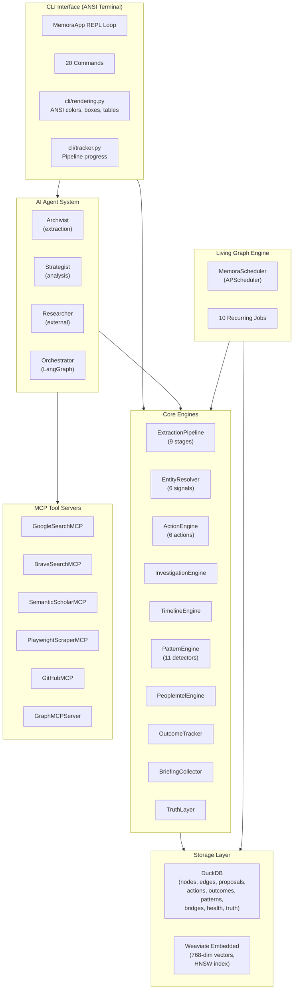
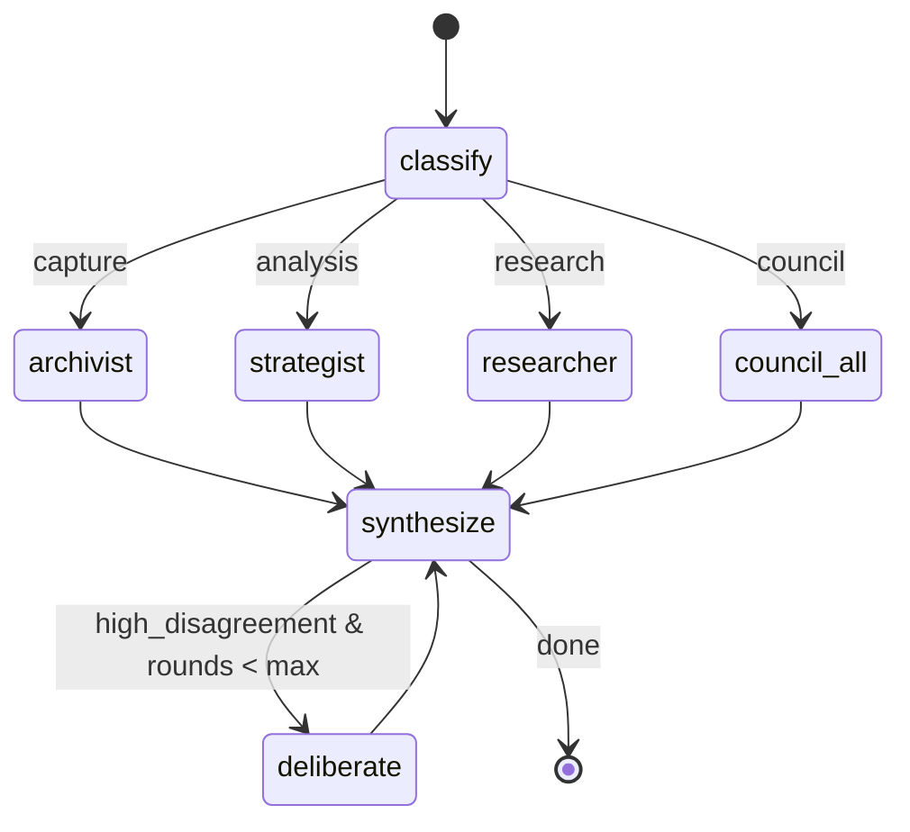

# Memora Architecture Document v2.0

> **Date:** March 2, 2026
> **Status:** Reflects the implemented codebase (not design documents)
> **Python:** 3.12+ &nbsp;|&nbsp; **License:** MIT

---

## Table of Contents

1. [System Overview](#1-system-overview)
2. [Input-to-Graph Pipeline](#2-input-to-graph-pipeline)
3. [Graph Ontology & Data Models](#3-graph-ontology--data-models)
4. [Database Schemas](#4-database-schemas)
5. [AI Agent System](#5-ai-agent-system)
6. [Adaptive RAG Pipeline (CRAG)](#6-adaptive-rag-pipeline-crag)
7. [Truth Layer](#7-truth-layer)
8. [Living Graph Engine (Background Jobs)](#8-living-graph-engine-background-jobs)
9. [Action Engine & Outcomes](#9-action-engine--outcomes)
10. [Investigation & Timeline](#10-investigation--timeline)
11. [People Intelligence](#11-people-intelligence)
12. [Pattern Detection](#12-pattern-detection)
13. [Notification & Briefing System](#13-notification--briefing-system)
14. [CLI Interface](#14-cli-interface)
15. [MCP Servers](#15-mcp-servers)
16. [Project Structure](#16-project-structure)
17. [Configuration & Environment](#17-configuration--environment)
18. [Test Suite Overview](#18-test-suite-overview)
19. [Implementation Status](#19-implementation-status)

---

## 1. System Overview

Memora is a **local-first decision intelligence platform** that converts unstructured text into a typed knowledge graph. An AI agent system (powered by OpenAI's `gpt-5-nano` via the Responses API) extracts entities and relationships, while background jobs keep the graph alive with decay scoring, pattern detection, and proactive notifications.

### Tech Stack

| Layer | Technology |
|---|---|
| Language | Python 3.12+ |
| Data Models | Pydantic v2 (`pydantic>=2.0`) |
| Graph Storage | DuckDB (`duckdb>=1.0`) |
| Vector Store | Weaviate embedded (`weaviate-client>=4.0`) |
| Embeddings | `sentence-transformers>=3.0` / `all-mpnet-base-v2` (768-dim) |
| LLM | OpenAI Responses API (`openai>=1.60`) / `gpt-5-nano` |
| Orchestration | LangGraph (`langgraph>=0.2`) |
| Background Jobs | APScheduler (`apscheduler>=3.10`) |
| HTTP Client | `httpx>=0.27` |
| Config | Pydantic Settings + YAML (`pyyaml>=6.0`) |
| Interface | CLI with ANSI terminal rendering (no web frontend) |

### High-Level Architecture



### Data Flow Summary

```
User input (text) --> CLI capture command
  --> ExtractionPipeline.run()
    --> Stage 1: Raw input capture
    --> Stage 2: Preprocessing (dates, currency, language, dedup)
    --> Stage 3: Archivist LLM extraction --> GraphProposal
    --> Stage 4: Entity resolution (6 signals)
    --> Stage 5: Proposal assembly (merge decisions)
    --> Stage 6: Validation gate (confidence routing)
    --> Stage 7: Review (auto-approve / digest / explicit)
    --> Stage 8: Graph commit (atomic DuckDB transaction)
    --> Stage 9: Post-commit (embeddings, edge weights, bridges, health, truth layer)
```

---

## 2. Input-to-Graph Pipeline

The `ExtractionPipeline` class in `memora/core/pipeline.py` implements a 9-stage async pipeline.

### Pipeline Stages

```python
class PipelineStage(IntEnum):
    RAW_INPUT = 1
    PREPROCESSING = 2
    EXTRACTION = 3
    ENTITY_RESOLUTION = 4
    PROPOSAL_ASSEMBLY = 5
    VALIDATION_GATE = 6
    REVIEW = 7
    GRAPH_COMMIT = 8
    POST_COMMIT = 9
```

### Pipeline State

```python
@dataclass
class PipelineState:
    capture_id: str
    raw_content: str
    processed_content: str = ""
    content_hash: str = ""
    language: str = "en"
    is_duplicate: bool = False
    proposal: GraphProposal | None = None
    resolutions: list[ResolutionResult] | None = None
    proposal_id: str | None = None
    route: ProposalRoute = ProposalRoute.AUTO
    stage: PipelineStage = PipelineStage.RAW_INPUT
    status: str = "processing"
    error: str | None = None
    clarification_needed: bool = False
    clarification_message: str = ""
```

### Pipeline Class Signature

```python
class ExtractionPipeline:
    def __init__(
        self,
        repo: GraphRepository,
        vector_store: VectorStore | None = None,
        embedding_engine: EmbeddingEngine | None = None,
        settings: Settings | None = None,
        archivist: ArchivistAgent | None = None,
        resolver: EntityResolver | None = None,
    ) -> None: ...

    async def run(
        self,
        capture_id: str,
        raw_content: str,
        on_stage: Callable[[PipelineStage, str], None] | None = None,
    ) -> PipelineState: ...
```

### Stage Details

| # | Stage | Method | Description |
|---|---|---|---|
| 1 | Raw Input | (entry) | Capture ID + raw text passed to `run()` |
| 2 | Preprocessing | `_preprocess` | Date normalization (`tomorrow`, `next Monday`, `in N days` to ISO), currency normalization (`$50k` to `$50,000.00`, `N bucks/dollars`), language detection (ASCII ratio heuristic), SHA-256 content hash |
| 3 | Extraction | `_extract` | Calls `ArchivistAgent.extract()` with processed text; returns `GraphProposal` via OpenAI Responses API with `json_schema` format |
| 4 | Entity Resolution | `_resolve_entities` | Runs `EntityResolver.resolve_nodes()` in a thread; multi-signal matching against existing graph |
| 5 | Proposal Assembly | `_assemble_proposal` | Applies merge decisions from entity resolution to the proposal |
| 6 | Validation Gate | `_validation_gate` | Routes by confidence: `AUTO` (>= threshold), `DIGEST`, or `EXPLICIT` (if merges/defers present) |
| 7 | Review | `_review` | Stores proposal in `proposals` table; auto-approved proposals proceed to commit |
| 8 | Graph Commit | `_commit` | Atomic DuckDB transaction: creates nodes (temp_id to real UUID mapping), updates existing nodes, creates edges |
| 9 | Post-Commit | `_post_commit` | Sequential: embeddings, edge weights, graph connectivity. Parallel: bridge detection, health recalc, notification triggers, truth layer cross-reference |

### Post-Commit Sub-stages

The post-commit stage runs sub-stages in a specific order:

1. **`_generate_embeddings`** -- batch embed all new nodes via `EmbeddingEngine.embed_batch()`, upsert to Weaviate
2. **`_compute_edge_weights`** -- cosine similarity of source/target embeddings for all edges touching new nodes
3. **`_ensure_graph_connectivity`** -- every node from this capture gets connected to the central You node (via similar existing node or direct fallback)
4. **Parallel via `asyncio.gather()`:**
   - `_detect_bridges` -- cross-network bridge discovery for new nodes
   - `_recalculate_health` -- network health for affected networks
   - `_check_notification_triggers` -- deadline notifications for new commitments
   - `_cross_reference_truth_layer` -- contradiction detection and fact auto-deposit

---

## 3. Graph Ontology & Data Models

All models are defined in `memora/graph/models.py` using Pydantic v2. Ontology constraints live in `memora/graph/ontology.py`.

### Node Types (12)

```python
class NodeType(str, Enum):
    # Life Context Nodes
    EVENT = "EVENT"
    PERSON = "PERSON"
    COMMITMENT = "COMMITMENT"
    DECISION = "DECISION"
    GOAL = "GOAL"
    FINANCIAL_ITEM = "FINANCIAL_ITEM"
    # Knowledge Nodes
    NOTE = "NOTE"
    IDEA = "IDEA"
    PROJECT = "PROJECT"
    CONCEPT = "CONCEPT"
    REFERENCE = "REFERENCE"
    INSIGHT = "INSIGHT"
```

### BaseNode

All node types extend `BaseNode`:

```python
class BaseNode(BaseModel):
    id: UUID = Field(default_factory=uuid4)
    node_type: NodeType
    title: str
    content: str = ""
    content_hash: str = ""
    properties: dict[str, Any] = Field(default_factory=dict)
    confidence: float = Field(default=1.0, ge=0.0, le=1.0)
    networks: list[NetworkType] = Field(default_factory=list)
    human_approved: bool = False
    proposed_by: str = ""
    source_capture_id: UUID | None = None
    access_count: int = 0
    last_accessed: datetime | None = None
    decay_score: float = 1.0
    review_date: datetime | None = None
    tags: list[str] = Field(default_factory=list)
    created_at: datetime = Field(default_factory=_utcnow)
    updated_at: datetime = Field(default_factory=_utcnow)

    def compute_content_hash(self) -> str: ...
```

### Specialized Node Models

| Model | Extra Fields |
|---|---|
| `EventNode` | `event_date`, `location`, `participants`, `event_type`, `duration`, `sentiment`, `recurring` |
| `PersonNode` | `name`, `aliases`, `role`, `relationship_to_user`, `contact_info`, `organization`, `last_interaction` |
| `CommitmentNode` | `due_date`, `status: CommitmentStatus`, `committed_by`, `committed_to`, `priority: Priority`, `description` |
| `DecisionNode` | `decision_date`, `options_considered`, `chosen_option`, `rationale`, `outcome`, `reversible` |
| `GoalNode` | `target_date`, `progress: float`, `milestones`, `status: GoalStatus`, `priority`, `success_criteria` |
| `FinancialItemNode` | `amount`, `currency`, `direction: FinancialDirection`, `category`, `recurring`, `frequency`, `counterparty` |
| `NoteNode` | `source_context`, `note_type: NoteType` |
| `IdeaNode` | `maturity: IdeaMaturity`, `domain`, `potential_impact` |
| `ProjectNode` | `status: ProjectStatus`, `start_date`, `target_date`, `team`, `deliverables`, `repository_url` |
| `ConceptNode` | `definition`, `domain`, `related_concepts`, `complexity_level: ComplexityLevel` |
| `ReferenceNode` | `url`, `author`, `publication_date`, `source_type`, `citation`, `archived` |
| `InsightNode` | `derived_from`, `actionable`, `cross_network`, `strength` |

### Edge Types (29 types in 7 categories)

```python
class EdgeCategory(str, Enum):
    STRUCTURAL = "STRUCTURAL"
    ASSOCIATIVE = "ASSOCIATIVE"
    PROVENANCE = "PROVENANCE"
    TEMPORAL = "TEMPORAL"
    PERSONAL = "PERSONAL"
    SOCIAL = "SOCIAL"
    NETWORK = "NETWORK"

class EdgeType(str, Enum):
    # Structural
    PART_OF = "PART_OF"
    CONTAINS = "CONTAINS"
    SUBTASK_OF = "SUBTASK_OF"
    # Associative
    RELATED_TO = "RELATED_TO"
    INSPIRED_BY = "INSPIRED_BY"
    CONTRADICTS = "CONTRADICTS"
    SIMILAR_TO = "SIMILAR_TO"
    COMPLEMENTS = "COMPLEMENTS"
    # Provenance
    DERIVED_FROM = "DERIVED_FROM"
    VERIFIED_BY = "VERIFIED_BY"
    SOURCE_OF = "SOURCE_OF"
    EXTRACTED_FROM = "EXTRACTED_FROM"
    # Temporal
    PRECEDED_BY = "PRECEDED_BY"
    EVOLVED_INTO = "EVOLVED_INTO"
    TRIGGERED = "TRIGGERED"
    CONCURRENT_WITH = "CONCURRENT_WITH"
    # Personal
    COMMITTED_TO = "COMMITTED_TO"
    DECIDED = "DECIDED"
    FELT_ABOUT = "FELT_ABOUT"
    RESPONSIBLE_FOR = "RESPONSIBLE_FOR"
    # Social
    KNOWS = "KNOWS"
    INTRODUCED_BY = "INTRODUCED_BY"
    OWES_FAVOR = "OWES_FAVOR"
    COLLABORATES_WITH = "COLLABORATES_WITH"
    REPORTS_TO = "REPORTS_TO"
    # Network
    BRIDGES = "BRIDGES"
    MEMBER_OF = "MEMBER_OF"
    IMPACTS = "IMPACTS"
    CORRELATES_WITH = "CORRELATES_WITH"
```

### Edge Model

```python
class Edge(BaseModel):
    id: UUID = Field(default_factory=uuid4)
    source_id: UUID
    target_id: UUID
    edge_type: EdgeType
    edge_category: EdgeCategory
    confidence: float = Field(default=1.0, ge=0.0, le=1.0)
    weight: float = 1.0
    bidirectional: bool = False
    properties: dict[str, Any] = Field(default_factory=dict)
    created_at: datetime = Field(default_factory=_utcnow)
    updated_at: datetime = Field(default_factory=_utcnow)
```

### Ontology Constraints

Defined in `EDGE_CONSTRAINTS` in `memora/graph/ontology.py`. Each edge type maps to `(allowed_source_types, allowed_target_types)` where `None` means any type:

```python
EDGE_CONSTRAINTS: dict[EdgeType, tuple[set[NodeType] | None, set[NodeType] | None]] = {
    EdgeType.SUBTASK_OF: (
        {NodeType.COMMITMENT, NodeType.GOAL, NodeType.PROJECT},
        {NodeType.COMMITMENT, NodeType.GOAL, NodeType.PROJECT},
    ),
    EdgeType.VERIFIED_BY: (None, {NodeType.REFERENCE, NodeType.PERSON}),
    EdgeType.SOURCE_OF: ({NodeType.REFERENCE, NodeType.PERSON}, None),
    EdgeType.COMMITTED_TO: ({NodeType.PERSON}, {NodeType.COMMITMENT}),
    EdgeType.DECIDED: ({NodeType.PERSON}, {NodeType.DECISION}),
    EdgeType.FELT_ABOUT: ({NodeType.PERSON}, None),
    EdgeType.RESPONSIBLE_FOR: ({NodeType.PERSON}, None),
    EdgeType.KNOWS: ({NodeType.PERSON}, {NodeType.PERSON}),
    EdgeType.INTRODUCED_BY: ({NodeType.PERSON}, {NodeType.PERSON}),
    EdgeType.OWES_FAVOR: ({NodeType.PERSON}, {NodeType.PERSON}),
    EdgeType.COLLABORATES_WITH: ({NodeType.PERSON}, {NodeType.PERSON}),
    EdgeType.REPORTS_TO: ({NodeType.PERSON}, {NodeType.PERSON}),
    EdgeType.MEMBER_OF: (None, {NodeType.PROJECT, NodeType.EVENT}),
    # All others: (None, None) -- any node type allowed
}
```

Validation functions:

```python
def validate_edge(source_type: NodeType, target_type: NodeType, edge_type: EdgeType) -> bool: ...
def get_category_for_edge_type(edge_type: EdgeType) -> EdgeCategory: ...
def get_valid_edge_types(source_type: NodeType, target_type: NodeType) -> list[EdgeType]: ...
def suggest_networks(text: str) -> list[tuple[str, float]]: ...
```

### Network Types & Keyword Classification

```python
class NetworkType(str, Enum):
    ACADEMIC = "ACADEMIC"
    PROFESSIONAL = "PROFESSIONAL"
    FINANCIAL = "FINANCIAL"
    HEALTH = "HEALTH"
    PERSONAL_GROWTH = "PERSONAL_GROWTH"
    SOCIAL = "SOCIAL"
    VENTURES = "VENTURES"
```

`NETWORK_KEYWORDS` maps each network to keyword lists for automatic classification via `suggest_networks()`. Confidence formula: `min(0.95, 0.3 + matches * 0.15)`.

### Pipeline Models

```python
class GraphProposal(BaseModel):
    source_capture_id: str
    timestamp: datetime
    confidence: float
    nodes_to_create: list[NodeProposal]
    nodes_to_update: list[NodeUpdate]
    edges_to_create: list[EdgeProposal]
    edges_to_update: list[EdgeUpdate]
    network_assignments: list[NetworkAssignment]
    human_summary: str = ""

class NodeProposal(BaseModel):
    temp_id: str
    node_type: NodeType
    title: str
    content: str = ""
    properties: dict[str, Any]
    confidence: float
    networks: list[NetworkType]
    temporal: TemporalAnchor | None = None

class EdgeProposal(BaseModel):
    source_id: str       # temp_id or existing graph UUID
    target_id: str
    edge_type: EdgeType
    edge_category: EdgeCategory
    properties: dict[str, Any]
    confidence: float
    bidirectional: bool = False
```

### Additional Enums

```python
class CommitmentStatus(str, Enum):     # open, completed, overdue, cancelled
class GoalStatus(str, Enum):           # active, paused, achieved, abandoned
class ProjectStatus(str, Enum):        # active, paused, completed, abandoned
class IdeaMaturity(str, Enum):         # seed, developing, mature, archived
class NoteType(str, Enum):             # observation, reflection, summary, quote
class ComplexityLevel(str, Enum):      # basic, intermediate, advanced
class Priority(str, Enum):             # low, medium, high, critical
class FinancialDirection(str, Enum):   # inflow, outflow
class HealthStatus(str, Enum):         # on_track, needs_attention, falling_behind
class Momentum(str, Enum):             # up, stable, down
class ProposalStatus(str, Enum):       # pending, approved, rejected
class ProposalRoute(str, Enum):        # auto, digest, explicit
class ActionType(str, Enum):           # COMPLETE_COMMITMENT, PROMOTE_IDEA, ARCHIVE_GOAL,
                                       # ADVANCE_GOAL, RECORD_OUTCOME, LINK_ENTITIES
class ActionStatus(str, Enum):         # completed, failed
class OutcomeRating(str, Enum):        # positive, neutral, negative, mixed
class PatternType(str, Enum):          # commitment_pattern, goal_lifecycle, temporal_pattern,
                                       # cross_network, relationship_pattern, decision_quality,
                                       # goal_alignment, commitment_scope, idea_maturity,
                                       # network_balance, outcome_pattern
class PatternSeverity(str, Enum):      # info, warning, critical
```

---

## 4. Database Schemas

### DuckDB Core Tables

All DuckDB DDL is in `memora/graph/repository.py` (`SCHEMA_SQL` constant).

```sql
-- Captures: raw user input
CREATE TABLE IF NOT EXISTS captures (
    id              VARCHAR PRIMARY KEY,
    modality        VARCHAR NOT NULL,
    raw_content     TEXT NOT NULL,
    processed_content TEXT,
    content_hash    VARCHAR(64) NOT NULL UNIQUE,
    language        VARCHAR(10),
    metadata        JSON,
    created_at      TIMESTAMP DEFAULT CURRENT_TIMESTAMP
);

-- Nodes: knowledge graph vertices
CREATE TABLE IF NOT EXISTS nodes (
    id              VARCHAR PRIMARY KEY,
    node_type       VARCHAR NOT NULL,
    title           VARCHAR NOT NULL,
    content         TEXT,
    content_hash    VARCHAR(64) NOT NULL,
    properties      JSON,
    confidence      DOUBLE CHECK (confidence >= 0 AND confidence <= 1),
    networks        VARCHAR[],
    human_approved  BOOLEAN DEFAULT FALSE,
    proposed_by     VARCHAR,
    source_capture_id VARCHAR,
    access_count    INTEGER DEFAULT 0,
    last_accessed   TIMESTAMP,
    decay_score     DOUBLE DEFAULT 1.0,
    review_date     TIMESTAMP,
    tags            VARCHAR[],
    created_at      TIMESTAMP DEFAULT CURRENT_TIMESTAMP,
    updated_at      TIMESTAMP DEFAULT CURRENT_TIMESTAMP,
    deleted         BOOLEAN DEFAULT FALSE
);

-- Edges: typed relationships
CREATE TABLE IF NOT EXISTS edges (
    id              VARCHAR PRIMARY KEY,
    source_id       VARCHAR NOT NULL,
    target_id       VARCHAR NOT NULL,
    edge_type       VARCHAR NOT NULL,
    edge_category   VARCHAR NOT NULL,
    properties      JSON,
    confidence      DOUBLE CHECK (confidence >= 0 AND confidence <= 1),
    weight          DOUBLE DEFAULT 1.0,
    bidirectional   BOOLEAN DEFAULT FALSE,
    created_at      TIMESTAMP DEFAULT CURRENT_TIMESTAMP,
    updated_at      TIMESTAMP DEFAULT CURRENT_TIMESTAMP
);

-- Proposals: pending/approved/rejected graph changes
CREATE TABLE IF NOT EXISTS proposals (
    id              VARCHAR PRIMARY KEY,
    capture_id      VARCHAR,
    agent_id        VARCHAR NOT NULL,
    status          VARCHAR DEFAULT 'pending',
    route           VARCHAR,
    confidence      DOUBLE,
    proposal_data   JSON NOT NULL,
    human_summary   TEXT,
    reviewed_at     TIMESTAMP,
    reviewer        VARCHAR,
    created_at      TIMESTAMP DEFAULT CURRENT_TIMESTAMP
);

-- Network Health: periodic health snapshots
CREATE TABLE IF NOT EXISTS network_health (
    id              VARCHAR PRIMARY KEY,
    network         VARCHAR NOT NULL,
    status          VARCHAR NOT NULL,
    momentum        VARCHAR DEFAULT 'stable',
    commitment_completion_rate DOUBLE,
    alert_ratio     DOUBLE,
    staleness_flags INTEGER DEFAULT 0,
    computed_at     TIMESTAMP DEFAULT CURRENT_TIMESTAMP
);

-- Bridges: cross-network connections
CREATE TABLE IF NOT EXISTS bridges (
    id              VARCHAR PRIMARY KEY,
    source_node_id  VARCHAR,
    target_node_id  VARCHAR,
    source_network  VARCHAR NOT NULL,
    target_network  VARCHAR NOT NULL,
    similarity      DOUBLE,
    llm_validated   BOOLEAN DEFAULT FALSE,
    meaningful      BOOLEAN,
    description     TEXT,
    discovered_at   TIMESTAMP DEFAULT CURRENT_TIMESTAMP
);

-- Schema Version tracking
CREATE TABLE IF NOT EXISTS schema_version (
    version         INTEGER PRIMARY KEY,
    description     VARCHAR DEFAULT '',
    applied_at      TIMESTAMP DEFAULT CURRENT_TIMESTAMP
);
```

### Migration Tables (via `memora/graph/migrations.py`)

Migrations are versioned and applied incrementally with rollback support:

| Version | Description | Tables/Indexes Added |
|---|---|---|
| v1 | Initial schema | (base tables above) |
| v2 | Dossier performance indexes | `idx_edges_source`, `idx_edges_target` |
| v3 | Actions table | `actions (id, action_type, status, source_node_id, target_node_id, params, result, executed_at)` |
| v4 | Outcomes table | `outcomes (id, node_id, node_type, outcome_text, rating, evidence, recorded_at)` + `idx_outcomes_node` |
| v5 | Patterns table | `detected_patterns (id, pattern_type, description, evidence, confidence, suggested_action, networks, first_detected, last_confirmed, status, created_at)` |
| v6 | Pattern severity/trend | Adds `severity`, `previous_value`, `current_value` columns + `idx_patterns_type_status` |

### Truth Layer Tables (via `memora/core/truth_layer.py`)

Created lazily by `TruthLayer._ensure_tables()`:

```sql
CREATE TABLE IF NOT EXISTS verified_facts (
    id                    VARCHAR PRIMARY KEY,
    node_id               VARCHAR NOT NULL,
    statement             TEXT NOT NULL,
    confidence            DOUBLE CHECK (confidence >= 0 AND confidence <= 1),
    status                VARCHAR DEFAULT 'active',      -- active, stale, contradicted, retired
    lifecycle             VARCHAR DEFAULT 'dynamic',     -- static, dynamic
    source_capture_id     VARCHAR,
    verified_at           TIMESTAMP,
    verified_by           VARCHAR,
    recheck_interval_days INTEGER DEFAULT 90,
    last_checked          TIMESTAMP,
    next_check            TIMESTAMP,
    metadata              JSON,
    created_at            TIMESTAMP DEFAULT CURRENT_TIMESTAMP,
    updated_at            TIMESTAMP DEFAULT CURRENT_TIMESTAMP
);

CREATE TABLE IF NOT EXISTS fact_checks (
    id              VARCHAR PRIMARY KEY,
    fact_id         VARCHAR NOT NULL,
    check_type      VARCHAR NOT NULL,
    result          VARCHAR NOT NULL,
    evidence        TEXT,
    checked_by      VARCHAR,
    checked_at      TIMESTAMP DEFAULT CURRENT_TIMESTAMP
);
```

### Notification Table (via `memora/core/notifications.py`)

```sql
CREATE TABLE IF NOT EXISTS notifications (
    id                VARCHAR PRIMARY KEY,
    type              VARCHAR NOT NULL,
    trigger_condition VARCHAR DEFAULT '',
    message           TEXT NOT NULL,
    related_node_ids  JSON DEFAULT '[]',
    priority          VARCHAR DEFAULT 'medium',
    read              BOOLEAN DEFAULT FALSE,
    created_at        TIMESTAMP DEFAULT CURRENT_TIMESTAMP
);
```

### Weaviate Collection

Defined in `memora/vector/store.py`:

```python
EMBEDDING_DIM = 768
COLLECTION_NAME = "NodeEmbeddings"

# Collection properties:
#   node_id:    TEXT
#   content:    TEXT
#   node_type:  TEXT
#   networks:   TEXT_ARRAY
#   updated_at: TEXT
#
# Vector config: self-provided (768-dim), HNSW auto-managed
```

### Central You Node

```python
YOU_NODE_ID = "00000000-0000-0000-0000-000000000001"
```

The `GraphRepository._ensure_you_node()` method creates a singleton PERSON node representing the user on first initialization. All other nodes are eventually connected to this ego node via the post-commit connectivity enforcement.

---

## 5. AI Agent System

Three specialized agents coordinated by a LangGraph orchestrator. All use `gpt-5-nano` as the default model via the OpenAI Responses API.

### Archivist Agent (`memora/agents/archivist.py`)

Extracts structured `GraphProposal` objects from unstructured text.

```python
DEFAULT_MODEL = "gpt-5-nano"

class ArchivistAgent:
    def __init__(
        self,
        api_key: str,
        vector_store: VectorStore | None = None,
        embedding_engine: EmbeddingEngine | None = None,
        you_node_id: str = "",
    ) -> None: ...

    async def extract(self, text: str, capture_id: str) -> ArchivistResult: ...

@dataclass
class ArchivistResult:
    proposal: GraphProposal | None = None
    clarification_needed: bool = False
    clarification_message: str = ""
```

Key implementation details:
- Uses `json_schema` response format with `GraphProposal.model_json_schema()` (titles stripped, `additionalProperties: false` added for strict mode)
- RAG context: retrieves existing nodes via vector similarity to provide extraction context
- Calls `async_call_with_retry()` for resilient API calls

### Strategist Agent (`memora/agents/strategist.py`)

Analytical advisor for cross-network insights, health interpretation, and decision support.

```python
DEFAULT_MODEL = "gpt-5-nano"

class StrategistAgent:
    def __init__(
        self,
        api_key: str,
        repo: GraphRepository | None = None,
        vector_store: VectorStore | None = None,
        embedding_engine: EmbeddingEngine | None = None,
        truth_layer: Any | None = None,
    ) -> None: ...

    async def analyze(self, query: str, context: dict) -> StrategistResult: ...
    async def critique(self, thesis: str, context: dict) -> CritiqueResult: ...

@dataclass
class StrategistResult:
    analysis: str = ""
    recommendations: list[dict[str, Any]]
    confidence: float = 0.8
    citations: list[str]
    token_usage: dict[str, int]

@dataclass
class CritiqueResult:
    analysis: str = ""
    counter_evidence: list[CounterEvidence]
    blind_spots: list[str]
    confidence: float = 0.75
    citations: list[str]
    token_usage: dict[str, int]
```

### Researcher Agent (`memora/agents/researcher.py`)

External information gathering with PII anonymization before outbound queries.

```python
DEFAULT_MODEL = "gpt-5-nano"

class ResearcherAgent:
    def __init__(
        self,
        api_key: str,
        truth_layer: TruthLayer | None = None,
    ) -> None: ...

    async def research(self, query: str, context: dict) -> ResearchResult: ...

@dataclass
class ResearchResult:
    answer: str = ""
    sources: list[ResearchSource]
    facts_to_deposit: list[dict[str, Any]]
    confidence: float = 0.7
    anonymized_query: str = ""
    token_usage: dict[str, int]
```

PII anonymization patterns:
- Email addresses
- Phone numbers
- SSN patterns
- Dollar amounts
- Date patterns

### Orchestrator (`memora/agents/orchestrator.py`)

LangGraph-based multi-agent coordinator with query classification, parallel agent dispatch, confidence-weighted synthesis, and iterative deliberation.

```python
class QueryType(str, Enum):
    CAPTURE = "capture"
    ANALYSIS = "analysis"
    RESEARCH = "research"
    COUNCIL = "council"

class CouncilState(TypedDict, total=False):
    query_id: str
    query: str
    query_type: str
    graph_context: dict[str, Any]
    archivist_output: dict[str, Any] | None
    strategist_output: dict[str, Any] | None
    researcher_output: dict[str, Any] | None
    synthesis: str
    confidence: float
    citations: list[str]
    deliberation_round: int
    max_deliberation_rounds: int
    high_disagreement: bool
    error: str | None

class Orchestrator:
    def __init__(
        self,
        api_key: str,
        repo: GraphRepository | None = None,
        vector_store: VectorStore | None = None,
        embedding_engine: EmbeddingEngine | None = None,
        truth_layer: Any | None = None,
        settings: Settings | None = None,
    ) -> None: ...

    def run(
        self,
        query: str,
        query_type: str | None = None,
        context: dict[str, Any] | None = None,
        max_deliberation_rounds: int = 2,
    ) -> OrchestratorResult: ...
```

### LangGraph State Machine



Graph nodes: `classify`, `archivist`, `strategist`, `researcher`, `council_all`, `synthesize`, `deliberate`.

---

## 6. Adaptive RAG Pipeline (CRAG)

The CRAG (Corrective Retrieval-Augmented Generation) pattern is implemented across the Orchestrator and agent system. Configurable via `Settings`:

```python
# CRAG settings
crag_relevance_threshold: float = 0.5
crag_min_results: int = 3
crag_term_coverage_threshold: float = 0.3
```

### CRAG Flow

1. **Retrieve** -- Vector search via Weaviate (`dense_search` or `hybrid_search`) for graph context relevant to the query
2. **Grade** -- Each retrieved node scored against query relevance; below `crag_relevance_threshold` triggers correction
3. **Correct** -- If insufficient relevant results, the Researcher agent supplements with external MCP tool calls
4. **Generate** -- Final synthesis by the Orchestrator using confidence-weighted merging of agent outputs

The Orchestrator's `_gather_context()` method performs RAG retrieval, and the `_synthesize_node()` merges all agent outputs into a final response.

---

## 7. Truth Layer

Implemented in `memora/core/truth_layer.py`. Provides verified fact storage with lifecycle management and contradiction detection.

```python
class FactStatus(str, Enum):
    ACTIVE = "active"
    STALE = "stale"
    CONTRADICTED = "contradicted"
    RETIRED = "retired"

class FactLifecycle(str, Enum):
    STATIC = "static"
    DYNAMIC = "dynamic"

class TruthLayer:
    def __init__(self, conn) -> None: ...
    def deposit_fact(
        self, node_id: str, statement: str, confidence: float,
        source_capture_id: str, verified_by: str, metadata: dict,
    ) -> str: ...
    def check_contradiction(self, claim: str, node_id: str) -> list[dict]: ...
    def query_facts(self, node_id: str, active_only: bool = True) -> list[dict]: ...
    def get_stale_facts(self, max_age_days: int = 90) -> list[dict]: ...
    def record_check(self, fact_id: str, result: str) -> None: ...
    def retire_fact(self, fact_id: str) -> None: ...
```

### How the Truth Layer integrates:

- **Pipeline post-commit**: New nodes without contradictions are auto-deposited as facts at confidence 0.7. Contradictions trigger notifications.
- **Researcher agent**: Deposits externally verified facts from MCP research
- **Outcome tracker**: Records outcomes as facts with confidence based on rating
- **Investigation engine**: Enriches nodes with associated verified facts

---

## 8. Living Graph Engine (Background Jobs)

The `MemoraScheduler` class (`memora/scheduler/scheduler.py`) wraps APScheduler's `AsyncIOScheduler` and registers 10 recurring jobs from `memora/scheduler/jobs.py`.

### Job Schedule

| # | Job ID | Schedule | Implementation |
|---|---|---|---|
| 1 | `decay_scoring` | Daily 2:00 AM | `run_decay_scoring` -- Recomputes decay scores for all nodes using exponential decay with per-network lambda values |
| 2 | `bridge_discovery_batch` | Daily 3:00 AM | `run_bridge_discovery_batch` -- Discovers cross-network bridges for recently modified nodes; batch LLM validation of unvalidated bridges |
| 3 | `network_health` | Every 6 hours | `run_network_health` -- Computes health status and momentum per network |
| 4 | `commitment_scan` | Daily 6:00 AM | `run_commitment_scan` -- Scans for overdue/approaching commitments; generates notifications |
| 5 | `relationship_decay` | Weekly Sunday 00:00 | `run_relationship_decay` -- Detects neglected PERSON relationships based on configurable thresholds |
| 6 | `spaced_repetition` | Daily 5:00 AM | `run_spaced_repetition_queue` -- Schedules review dates using SM-2 algorithm |
| 7 | `gap_detection` | Weekly Sunday 1:00 AM | `run_gap_detection` -- Finds information gaps and orphan nodes |
| 8 | `daily_briefing` | Daily 7:00 AM | `run_daily_briefing` -- Aggregates data from all subsystems for morning briefing |
| 9 | `pattern_detection` | Daily 4:00 AM | `run_pattern_detection` -- Runs all 11 pattern detectors |
| 10 | `outcome_review` | Daily 6:30 AM | `run_outcome_review` -- Reviews pending outcomes for decisions/goals |

### Scheduler Configuration

```python
class MemoraScheduler:
    def __init__(
        self,
        repo,
        app_state=None,
        vector_store=None,
        embedding_engine=None,
        truth_layer=None,
        settings=None,
    ) -> None: ...

    def start(self) -> None: ...
    def shutdown(self) -> None: ...
```

Job defaults: `coalesce=True`, `max_instances=1`, `misfire_grace_time=3600`.

### Decay Scoring (`memora/core/decay.py`)

Exponential decay with network-specific lambdas:

```python
DEFAULT_NETWORK_LAMBDAS = {
    "ACADEMIC": 0.05,
    "PROFESSIONAL": 0.03,
    "FINANCIAL": 0.02,
    "HEALTH": 0.05,
    "PERSONAL_GROWTH": 0.04,
    "SOCIAL": 0.07,
    "VENTURES": 0.03,
}
```

Active nodes (open commitments, active goals/projects) are pinned at decay_score = 1.0. Node types use meaningful temporal fields for decay calculation:

```python
_TEMPORAL_FIELDS = {
    "EVENT": "event_date",
    "COMMITMENT": "due_date",
    "DECISION": "decision_date",
    "GOAL": "target_date",
    "PROJECT": "target_date",
    "PERSON": "last_interaction",
}
```

### Health Scoring (`memora/core/health_scoring.py`)

```python
# Status thresholds
FALLING_BEHIND_COMPLETION = 0.4
NEEDS_ATTENTION_COMPLETION = 0.7
FALLING_BEHIND_ALERT_RATIO = 0.3
NEEDS_ATTENTION_ALERT_RATIO = 0.1
FALLING_BEHIND_STALENESS = 2
STALENESS_DECAY_THRESHOLD = 0.3

class HealthScoring:
    def __init__(self, repo: GraphRepository) -> None: ...
    def compute_network_health(self, network: str) -> dict: ...
    def compute_all_networks(self) -> list[dict]: ...
```

### Spaced Repetition (`memora/core/spaced_repetition.py`)

SM-2 algorithm for scheduling knowledge review:

```python
DEFAULT_EASINESS_FACTOR = 2.5
MIN_EASINESS_FACTOR = 1.3

class SpacedRepetition:
    def __init__(self, repo: GraphRepository) -> None: ...
    def initialize_node(self, node_id: str) -> None: ...
    # SM-2 parameters stored in node properties:
    #   easiness_factor, repetition_number, interval, review_date
```

---

## 9. Action Engine & Outcomes

### Action Engine (`memora/core/actions.py`)

Six typed graph actions with preconditions, validation, and audit logging:

```python
class ActionEngine:
    def __init__(
        self, repo, truth_layer=None, health_scoring=None, notification_manager=None,
    ) -> None: ...

    # Registered actions:
    # COMPLETE_COMMITMENT -- marks commitment as completed, deposits truth layer fact
    # PROMOTE_IDEA        -- promotes idea to project (changes node type/status)
    # ARCHIVE_GOAL        -- archives a goal (achieved/abandoned)
    # ADVANCE_GOAL        -- updates goal progress percentage
    # RECORD_OUTCOME      -- records outcome for decision/goal/commitment
    # LINK_ENTITIES       -- creates new edge between two nodes
```

### Action Record Model

```python
class ActionRecord(BaseModel):
    id: UUID = Field(default_factory=uuid4)
    action_type: ActionType
    status: ActionStatus = ActionStatus.COMPLETED
    source_node_id: str | None = None
    target_node_id: str | None = None
    params: dict[str, Any] = Field(default_factory=dict)
    result: dict[str, Any] = Field(default_factory=dict)
    executed_at: datetime = Field(default_factory=_utcnow)
```

### Outcome Tracker (`memora/core/outcomes.py`)

Feedback loop that updates node confidence, deposits facts, and manages goal/commitment status:

```python
# Confidence adjustments per rating
_CONFIDENCE_DELTA = {
    "positive": 0.1,
    "negative": -0.15,
    "mixed": 0.0,
    "neutral": 0.0,
}

_TRUTH_CONFIDENCE = {
    "positive": 0.9,
    "neutral": 0.7,
    "negative": 0.5,
    "mixed": 0.6,
}

class OutcomeTracker:
    def __init__(self, repo, truth_layer=None) -> None: ...
    def record_outcome(self, node_id: str, text: str, rating: str, evidence_ids: list[str] | None) -> str: ...
    def get_pending_outcomes(self) -> list[dict]: ...
    def get_outcome_stats(self) -> dict: ...
    def generate_outcome_prompts(self) -> list[dict]: ...
```

### Outcome Model

```python
class Outcome(BaseModel):
    id: UUID = Field(default_factory=uuid4)
    node_id: str
    node_type: str
    outcome_text: str
    rating: OutcomeRating
    evidence: list[str] = Field(default_factory=list)
    recorded_at: datetime = Field(default_factory=_utcnow)
```

---

## 10. Investigation & Timeline

### Investigation Engine (`memora/core/investigation.py`)

Deep link analysis and path-finding with context enrichment:

```python
class InvestigationEngine:
    def __init__(self, repo, truth_layer=None) -> None: ...
    def expand(self, node_id: str, hops: int = 1,
               node_types: list[str] | None = None,
               edge_types: list[str] | None = None,
               networks: list[str] | None = None) -> dict: ...
    def search(self, query: str, **filters) -> list[dict]: ...
    def find_path(self, source_id: str, target_id: str) -> list[dict]: ...
    def find_common(self, node_ids: list[str]) -> dict: ...
    def highlight_bridges(self, network_a: str, network_b: str) -> list[dict]: ...
    def get_node_summary(self, node_id: str) -> dict: ...
```

### Timeline Engine (`memora/core/timeline.py`)

Temporal reconstruction and causal chain tracing:

```python
class TimelineEngine:
    def __init__(self, repo) -> None: ...
    def get_timeline(self, start: str | None = None, end: str | None = None,
                     networks: list[str] | None = None,
                     node_types: list[str] | None = None,
                     limit: int = 100,
                     include_actions: bool = True) -> list[dict]: ...
    def trace_causal_chain(self, node_id: str) -> list[dict]: ...
    def find_concurrent(self, node_id: str, window_days: int = 7) -> list[dict]: ...
    def detect_activity_bursts(self, days: int = 90) -> list[dict]: ...
    def get_weekly_digest(self) -> dict: ...
```

Timeline entries interleave nodes and actions, sorted by best-available date (event_date, due_date, decision_date, etc. take priority over created_at).

---

## 11. People Intelligence

### People Intel Engine (`memora/core/people_intel.py`)

Palantir-style people directory with ranked connections and network statistics:

```python
SIGNAL_WEIGHTS = {
    "edge_weight": 0.25,
    "edge_confidence": 0.15,
    "edge_type_importance": 0.20,
    "recency": 0.25,
    "shared_connections": 0.15,
}

RECENCY_HALF_LIFE_DAYS = 35.0

EDGE_TYPE_IMPORTANCE = {
    "COLLABORATES_WITH": 1.0,
    "REPORTS_TO": 0.9,
    "COMMITTED_TO": 0.85,
    "RESPONSIBLE_FOR": 0.8,
    "DECIDED": 0.75,
    "INTRODUCED_BY": 0.7,
    "KNOWS": 0.6,
    "RELATED_TO": 0.5,
    "BRIDGES": 0.5,
    "MEMBER_OF": 0.45,
    "PART_OF": 0.4,
    "SIMILAR_TO": 0.35,
    "DERIVED_FROM": 0.3,
}
```

Recency scoring uses exponential decay with a 35-day half-life.

### Relationship Decay Detector (`memora/core/relationship_decay.py`)

Configurable thresholds for detecting neglected relationships:

```python
DEFAULT_THRESHOLDS = {
    "close": 7,        # days
    "regular": 14,
    "acquaintance": 30,
}

class RelationshipDecayDetector:
    def __init__(self, repo: GraphRepository) -> None: ...
    def scan(self) -> list[dict[str, Any]]: ...
    # Returns: person_name, days_since_interaction, relationship_type,
    #          threshold, node_id, outstanding_commitments
```

---

## 12. Pattern Detection

Implemented in `memora/core/patterns.py`. The `PatternEngine` runs 11 behavioral pattern detectors with a consistent confidence model.

### Confidence Model

```python
_CONFIDENCE_BASE_MIN = 0.25
_CONFIDENCE_BASE_MAX = 0.55
_CONFIDENCE_VOLUME_CAP = 20

def _compute_confidence(data_points: int, signal_strength: float) -> float:
    volume_ratio = min(data_points / _CONFIDENCE_VOLUME_CAP, 1.0)
    base = _CONFIDENCE_BASE_MIN + (_CONFIDENCE_BASE_MAX - _CONFIDENCE_BASE_MIN) * volume_ratio
    return min(0.95, base + signal_strength * 0.4)
```

### Pattern Engine

```python
class PatternEngine:
    PATTERN_TTL_DAYS = 30

    def __init__(self, repo) -> None: ...
    def detect_all(self) -> list[dict]: ...
```

### 11 Pattern Detectors

| Detector Method | PatternType | Description |
|---|---|---|
| `detect_commitment_patterns` | `COMMITMENT_PATTERN` | Completion rates, overdue frequency |
| `detect_goal_lifecycle_patterns` | `GOAL_LIFECYCLE` | Abandonment rates, progress stalls |
| `detect_temporal_patterns` | `TEMPORAL_PATTERN` | Activity time-of-day and day-of-week patterns |
| `detect_cross_network_correlations` | `CROSS_NETWORK` | Co-occurrence between networks |
| `detect_relationship_patterns` | `RELATIONSHIP_PATTERN` | Social interaction frequency, decay trends |
| `detect_outcome_patterns` | `OUTCOME_PATTERN` | Outcome rating distributions |
| `detect_decision_quality_patterns` | `DECISION_QUALITY` | Decision outcome quality over time |
| `detect_goal_alignment_patterns` | `GOAL_ALIGNMENT` | Goals across networks, coverage gaps |
| `detect_commitment_scope_patterns` | `COMMITMENT_SCOPE` | Over-commitment detection |
| `detect_idea_maturity_patterns` | `IDEA_MATURITY` | Idea promotion/archival rates |
| `detect_network_balance_patterns` | `NETWORK_BALANCE` | Node count imbalance across networks |

### Pattern Model

```python
class Pattern(BaseModel):
    id: UUID = Field(default_factory=uuid4)
    pattern_type: PatternType
    description: str
    evidence: list[str] = Field(default_factory=list)
    confidence: float = Field(default=0.5, ge=0.0, le=1.0)
    severity: PatternSeverity = PatternSeverity.INFO
    suggested_action: str = ""
    networks: list[str] = Field(default_factory=list)
    first_detected: datetime = Field(default_factory=_utcnow)
    last_confirmed: datetime = Field(default_factory=_utcnow)
    status: str = "active"
    previous_value: float | None = None
    current_value: float | None = None
    created_at: datetime = Field(default_factory=_utcnow)
```

---

## 13. Notification & Briefing System

### Notification Types

Defined in `memora/core/notifications.py`:

```python
DEADLINE_APPROACHING = "deadline_approaching"
RELATIONSHIP_DECAY = "relationship_decay"
STALE_COMMITMENT = "stale_commitment"
HEALTH_DROP = "health_drop"
BRIDGE_DISCOVERED = "bridge_discovered"
GOAL_DRIFT = "goal_drift"
REVIEW_DUE = "review_due"
```

Priority ordering: `critical > high > medium > low`.

### Notification Manager

```python
class NotificationManager:
    def __init__(self, conn) -> None: ...
    def create_notification(
        self, type: str, message: str,
        related_node_ids: list[str] = None,
        priority: str = "medium",
        trigger_condition: str = "",
    ) -> str: ...
    def get_unread(self, limit: int = 50) -> list[dict]: ...
    def mark_read(self, notification_id: str) -> None: ...
    def get_by_type(self, type: str, limit: int = 20) -> list[dict]: ...
```

### Briefing Collector (`memora/core/briefing.py`)

Aggregates data from all subsystems for the daily briefing:

- Open commitments and approaching deadlines
- Network health scores and momentum changes
- Relationship decay alerts
- Recent bridges discovered
- Pending proposals for review
- Pattern detection highlights
- Spaced repetition items due for review
- Unread notifications

`get_last_briefing_time()` checks actions and notifications tables to determine when the last briefing was generated.

---

## 14. CLI Interface

The CLI is a REPL-based terminal application with ANSI rendering, implemented across `cli/app.py`, `cli/rendering.py`, `cli/tracker.py`, and `cli/commands/`.

### Architecture

```python
# cli/app.py
class MemoraApp:
    def __init__(self): ...
    def boot(self): ...              # Staged boot sequence with subsystem status
    def run(self): ...               # Main REPL loop
    def _get_embedding_engine(self):  # Lazy initialization
    def _get_vector_store(self):      # Lazy initialization
    def _get_pipeline(self):          # Lazy initialization
    def _get_orchestrator(self):      # Lazy initialization
    def _get_strategist(self):        # Lazy initialization
    def _gather_telemetry(self) -> dict:  # Live stats for command deck
```

### Rendering System (`cli/rendering.py`)

Palantir Gotham-inspired design with 256-color ANSI palette:

- `C` class: ANSI color codes (full 256-color palette)
- `boot_sequence()`: Staged subsystem initialization display
- `command_deck()`: Main menu with live telemetry (node count, edge count, density, network health bars)
- `goodbye_card()`: Exit display
- `divider()`, `horizontal_bar()`, `menu_option()`, `prompt()`, `spinner()`: UI primitives
- `subcommand_header()`: Consistent subcommand headers with box drawing

### Pipeline Tracker (`cli/tracker.py`)

Real-time visualization of the 9-stage pipeline progress in the terminal:

```python
_STAGE_ICONS = {
    "pending":  "   ",
    "running":  " > ",
    "done":     " + ",
    "failed":   " x ",
    "skipped":  " - ",
}
```

### Commands (20)

| Key | Command | Module | Description |
|---|---|---|---|
| `c` | Capture | `cli/commands/capture.py` | Ingest text through the extraction pipeline |
| `p` | Profile | `cli/commands/profile.py` | View/edit user profile (You node) |
| `r` | Proposals | `cli/commands/proposals.py` | Review pending graph proposals |
| `d` | Dossier | `cli/commands/dossier.py` | Deep-dive on any node with full context |
| `i` | Investigate | `cli/commands/investigate.py` | Interactive graph exploration mode |
| `w` | Browse | `cli/commands/browse.py` | Browse nodes by type/network with pagination |
| `s` | Search | (routes to dossier) | Semantic search across the graph |
| `b` | Briefing | `cli/commands/briefing.py` | Daily briefing with aggregated intelligence |
| `k` | Critique | `cli/commands/critique.py` | Strategist critique of a thesis/assumption |
| `u` | Council | `cli/commands/council.py` | Multi-agent AI council deliberation |
| `t` | Timeline | `cli/commands/timeline.py` | Chronological event/action view |
| `o` | Outcomes | `cli/commands/outcomes.py` | Record and view outcomes for decisions/goals |
| `a` | Patterns | `cli/commands/patterns.py` | View detected behavioral patterns |
| `g` | Stats | `cli/commands/stats.py` | Graph statistics and health dashboard |
| `n` | Networks | `cli/commands/networks.py` | Per-network health, nodes, and bridges |
| `e` | People | `cli/commands/people.py` | People directory with relationship strength |
| `j` | Actions | `cli/commands/actions.py` | Execute typed graph actions |
| `0` | Settings | (inline in app.py) | Display current configuration |
| `x` | Clear Data | `cli/commands/clear_data.py` | Reset graph data |
| `q` | Quit | (inline in app.py) | Exit the application |

### Boot Sequence

On startup, `MemoraApp.boot()` initializes subsystems and reports status:

```
Subsystem Status:
  graph:     ONLINE | OFFLINE
  vector:    ONLINE | OFFLINE
  embedding: STANDBY (lazy-loaded on first use)
  council:   ONLINE | STANDBY (depends on API key)
  scheduler: ONLINE
```

---

## 15. MCP Servers

Six Model Context Protocol tool servers in `memora/mcp/`, all using `httpx` for HTTP transport:

### GoogleSearchMCP (`memora/mcp/google_search.py`)

```python
class GoogleSearchMCP:
    def __init__(self, api_key: str | None = None, search_engine_id: str | None = None) -> None: ...
    def get_tool_definition(self) -> dict[str, Any]: ...
    def search(self, query: str, num_results: int = 5) -> list[dict]: ...
```
- Rate limit: 100 queries/day (free tier)
- Env vars: `GOOGLE_API_KEY`, `GOOGLE_SEARCH_ENGINE_ID`

### BraveSearchMCP (`memora/mcp/brave_search.py`)

```python
class BraveSearchMCP:
    def __init__(self, api_key: str | None = None) -> None: ...
    def search(self, query: str, count: int = 5) -> list[dict]: ...
```
- Rate limit: 2,000 queries/month (free tier)
- Env var: `BRAVE_API_KEY`

### SemanticScholarMCP (`memora/mcp/semantic_scholar.py`)

```python
class SemanticScholarMCP:
    def __init__(self, api_key: str | None = None) -> None: ...
    def search_papers(self, query: str, limit: int = 5) -> list[dict]: ...
    def get_paper(self, paper_id: str) -> dict: ...
    def get_citations(self, paper_id: str) -> list[dict]: ...
```
- API: Semantic Scholar Graph API v1

### PlaywrightScraperMCP (`memora/mcp/playwright_scraper.py`)

```python
class PlaywrightScraperMCP:
    def __init__(self, timeout: float = 15.0) -> None: ...
    def scrape(self, url: str) -> dict: ...
```
- Uses `httpx` for lightweight HTTP scraping (Playwright optional for JS-heavy sites)

### GitHubMCP (`memora/mcp/github_mcp.py`)

```python
class GitHubMCP:
    def __init__(self, token: str | None = None) -> None: ...
    def search_repos(self, query: str, limit: int = 5) -> list[dict]: ...
    def search_code(self, query: str, limit: int = 5) -> list[dict]: ...
```
- Env var: `GITHUB_TOKEN`

### GraphMCPServer (`memora/mcp/graph_mcp.py`)

Internal tool server for agents to query their own knowledge graph:

```python
class GraphMCPServer:
    def __init__(
        self,
        repo: GraphRepository,
        vector_store: VectorStore | None = None,
        embedding_engine: EmbeddingEngine | None = None,
    ) -> None: ...
    def query_nodes(self, filters: dict) -> list[dict]: ...
    def semantic_search(self, query: str, top_k: int = 10) -> list[dict]: ...
    def get_neighborhood(self, node_id: str, hops: int = 1) -> dict: ...
    def get_truth_facts(self, node_id: str) -> list[dict]: ...
```

---

## 16. Project Structure

```
Memora/
|-- cli/
|   |-- __init__.py
|   |-- app.py                     # MemoraApp REPL loop, boot sequence
|   |-- rendering.py               # ANSI colors, boxes, tables, progress bars
|   |-- tracker.py                 # Pipeline progress visualization
|   |-- commands/
|       |-- __init__.py
|       |-- actions.py             # Execute typed graph actions
|       |-- briefing.py            # Daily briefing display
|       |-- browse.py              # Browse nodes by type/network
|       |-- capture.py             # Text ingestion pipeline
|       |-- clear_data.py          # Reset graph data
|       |-- council.py             # Multi-agent deliberation
|       |-- critique.py            # Strategist critique
|       |-- dossier.py             # Deep node inspection
|       |-- investigate.py         # Interactive graph exploration
|       |-- networks.py            # Per-network dashboard
|       |-- outcomes.py            # Outcome recording/viewing
|       |-- patterns.py            # Behavioral pattern display
|       |-- people.py              # People directory
|       |-- profile.py             # User profile management
|       |-- proposals.py           # Proposal review queue
|       |-- stats.py               # Graph statistics
|       |-- timeline.py            # Chronological view
|
|-- memora/
|   |-- __init__.py
|   |-- config.py                  # Settings (Pydantic BaseSettings + YAML)
|   |
|   |-- agents/
|   |   |-- __init__.py
|   |   |-- archivist.py           # LLM extraction agent
|   |   |-- orchestrator.py        # LangGraph multi-agent coordinator
|   |   |-- researcher.py          # External research agent
|   |   |-- strategist.py          # Analysis/critique agent
|   |
|   |-- core/
|   |   |-- __init__.py
|   |   |-- actions.py             # ActionEngine (6 typed actions)
|   |   |-- async_utils.py         # run_async sync/async bridge
|   |   |-- backup.py              # BackupManager (MAX_BACKUPS=10)
|   |   |-- bridge_discovery.py    # Cross-network bridge detection
|   |   |-- briefing.py            # BriefingCollector
|   |   |-- commitment_scan.py     # Overdue commitment detection
|   |   |-- decay.py               # Exponential decay scoring
|   |   |-- entity_resolution.py   # 6-signal entity resolver
|   |   |-- gap_detection.py       # Information gap finder
|   |   |-- health_scoring.py      # Network health computation
|   |   |-- investigation.py       # InvestigationEngine
|   |   |-- json_utils.py          # extract_json for LLM responses
|   |   |-- logging_config.py      # JSONFormatter, PipelineTimingLogger, LLMCallLogger
|   |   |-- notifications.py       # NotificationManager + 7 types
|   |   |-- outcomes.py            # OutcomeTracker
|   |   |-- patterns.py            # PatternEngine (11 detectors)
|   |   |-- people_intel.py        # PeopleIntelEngine
|   |   |-- pipeline.py            # 9-stage ExtractionPipeline
|   |   |-- relationship_decay.py  # RelationshipDecayDetector
|   |   |-- retry.py               # Exponential backoff for API calls
|   |   |-- spaced_repetition.py   # SM-2 algorithm
|   |   |-- timeline.py            # TimelineEngine
|   |   |-- truth_layer.py         # TruthLayer (verified facts)
|   |
|   |-- graph/
|   |   |-- __init__.py
|   |   |-- migrations.py          # Versioned migrations (v2-v6)
|   |   |-- models.py              # All Pydantic models & enums
|   |   |-- ontology.py            # Edge constraints & validation
|   |   |-- repository.py          # DuckDB GraphRepository
|   |
|   |-- mcp/
|   |   |-- __init__.py
|   |   |-- brave_search.py        # Brave Search API
|   |   |-- github_mcp.py          # GitHub API
|   |   |-- google_search.py       # Google Custom Search API
|   |   |-- graph_mcp.py           # Internal graph query tool
|   |   |-- playwright_scraper.py  # Web scraping via httpx
|   |   |-- semantic_scholar.py    # Academic paper search
|   |
|   |-- scheduler/
|   |   |-- __init__.py
|   |   |-- jobs.py                # 10 job implementations
|   |   |-- scheduler.py           # MemoraScheduler (APScheduler wrapper)
|   |
|   |-- vector/
|       |-- __init__.py
|       |-- embeddings.py          # EmbeddingEngine (sentence-transformers)
|       |-- store.py               # VectorStore (Weaviate embedded)
|
|-- tests/
|   |-- __init__.py
|   |-- conftest.py
|   |-- unit/
|   |   |-- test_repository.py
|   |   |-- test_gap_detection.py
|   |   |-- test_retry.py
|   |   |-- test_commitment_scan.py
|   |   |-- test_crag.py
|   |   |-- test_graph_commit.py
|   |   |-- test_truth_layer.py
|   |   |-- test_models.py
|   |   |-- test_spaced_repetition.py
|   |   |-- test_health_scoring.py
|   |   |-- test_bridge_discovery.py
|   |   |-- test_decay.py
|   |   |-- test_entity_resolution.py
|   |   |-- test_ontology.py
|   |   |-- test_vector_store.py
|   |   |-- test_pipeline.py
|   |-- integration/
|       |-- test_election_graph.py
|       |-- test_archivist.py
|       |-- test_rag_pipeline.py
|       |-- test_council.py
|
|-- cli.py                         # Entry point (imports cli/app.py)
|-- reingest.py                    # Batch re-ingestion utility
|-- pyproject.toml                 # Build config & dependencies
|-- requirements.txt               # Pinned dependencies
|-- .env.example                   # Environment variable template
|-- .gitignore
|-- LICENSE
```

---

## 17. Configuration & Environment

### Settings Class (`memora/config.py`)

```python
DEFAULT_DATA_DIR = Path.home() / ".memora"

class Settings(BaseSettings):
    model_config = SettingsConfigDict(
        env_prefix="MEMORA_",
        env_file=".env",
        env_file_encoding="utf-8",
        extra="ignore",
    )

    # API keys
    openai_api_key: str = Field(default="", alias="OPENAI_API_KEY")

    # Paths
    data_dir: Path = Field(default=DEFAULT_DATA_DIR)

    # Embedding
    embedding_model: str = "all-mpnet-base-v2"

    # Confidence & governance
    auto_approve_threshold: float = 0.85

    # Decay parameters
    decay_lambda: float = 0.01
    decay_lambda_overrides: dict[str, float]  # per-network

    # Relationship decay thresholds (days)
    relationship_decay_thresholds: dict[str, int]  # close: 7, regular: 14, acquaintance: 30

    # Spaced repetition
    sm2_default_easiness: float = 2.5

    # Bridge discovery
    bridge_similarity_threshold: float = 0.75

    # LLM retry settings
    llm_max_retries: int = 3
    llm_retry_base_delay: float = 1.0
    llm_retry_max_delay: float = 30.0

    # CRAG settings
    crag_relevance_threshold: float = 0.5
    crag_min_results: int = 3
    crag_term_coverage_threshold: float = 0.3

    # Logging
    log_level: Literal["DEBUG", "INFO", "WARNING", "ERROR"] = "INFO"

    # Derived paths
    @property
    def graph_dir(self) -> Path: ...    # data_dir / "graph"
    @property
    def vector_dir(self) -> Path: ...   # data_dir / "vectors"
    @property
    def models_dir(self) -> Path: ...   # data_dir / "models"
    @property
    def db_path(self) -> Path: ...      # graph_dir / "memora.duckdb"
    @property
    def config_yaml_path(self) -> Path: ...  # data_dir / "config.yaml"
    @property
    def log_dir(self) -> Path: ...      # data_dir / "logs"
    @property
    def backups_dir(self) -> Path: ...  # data_dir / "backups"
```

### Data Directory Structure

```
~/.memora/
|-- config.yaml          # User configuration overrides
|-- graph/
|   |-- memora.duckdb    # Main database
|-- vectors/             # Weaviate embedded persistence
|-- models/              # Cached sentence-transformer models
|-- backups/             # Database snapshots (max 10)
|-- logs/                # Structured JSON logs
```

### Default config.yaml

```yaml
version: 1
auto_approve_threshold: 0.85
decay_lambda:
  academic: 0.05
  professional: 0.03
  financial: 0.02
  health: 0.05
  personal_growth: 0.04
  social: 0.07
  ventures: 0.03
relationship_decay_thresholds:
  close: 7
  regular: 14
  acquaintance: 30
sm2_default_easiness: 2.5
bridge_similarity_threshold: 0.75
embedding_model: all-mpnet-base-v2
data_dir: ~/.memora
log_level: INFO
```

### Environment Variables

| Variable | Description | Required |
|---|---|---|
| `OPENAI_API_KEY` | OpenAI API key for gpt-5-nano | Yes (for AI features) |
| `GOOGLE_API_KEY` | Google Custom Search API key | No |
| `GOOGLE_SEARCH_ENGINE_ID` | Google CSE ID | No |
| `BRAVE_API_KEY` | Brave Search API key | No |
| `GITHUB_TOKEN` | GitHub personal access token | No |
| `MEMORA_LOG_LEVEL` | Override log level | No |
| `MEMORA_DATA_DIR` | Override data directory | No |

### Logging (`memora/core/logging_config.py`)

```python
class JSONFormatter(logging.Formatter):
    # Outputs single-line JSON with: timestamp, level, logger, message
    # Plus optional structured fields: stage, capture_id, duration_ms,
    # tokens, cost, job_name, node_count, model, component

class PipelineTimingLogger:
    def start_stage(self, stage_name: str, capture_id: str) -> float: ...
    def end_stage(self, stage_name: str, capture_id: str, start_time: float) -> None: ...

class LLMCallLogger:
    # Logs model, tokens, cost per call
```

### Backup (`memora/core/backup.py`)

```python
class BackupManager:
    MAX_BACKUPS = 10

    def __init__(self, db_path: Path, backups_dir: Path) -> None: ...
    def create_snapshot(self) -> Path | None: ...
    def restore_snapshot(self, snapshot_path: Path) -> bool: ...
    def list_snapshots(self) -> list[Path]: ...
    def prune_old_snapshots(self) -> int: ...
```

### Retry (`memora/core/retry.py`)

```python
# Retryable exceptions
_RETRYABLE_OPENAI = (RateLimitError, InternalServerError, APIConnectionError, APITimeoutError)
_RETRYABLE_HTTP = (ConnectTimeout, ReadTimeout, WriteTimeout, ConnectError)

def is_retryable(exc: Exception) -> bool: ...
def retry_on_transient(func: F) -> F: ...           # Decorator
async def async_call_with_retry(func, *args, **kwargs): ...  # Async helper
def call_with_retry(func, *args, **kwargs): ...      # Sync helper
```

### Re-ingestion Utility (`reingest.py`)

```python
# Batch re-ingestion of captures from JSON file
# Reads from /tmp/memora_captures.json
# Runs each capture through the full ExtractionPipeline sequentially
```

---

## 18. Test Suite Overview

Test configuration in `pyproject.toml`:

```toml
[tool.pytest.ini_options]
asyncio_mode = "auto"
testpaths = ["tests"]
pythonpath = ["."]
```

### Unit Tests (17)

| Test File | Covers |
|---|---|
| `test_repository.py` | GraphRepository CRUD, node/edge operations, query filters |
| `test_gap_detection.py` | Gap detection engine |
| `test_retry.py` | Retry logic, backoff, exception classification |
| `test_commitment_scan.py` | Overdue commitment detection and notification |
| `test_crag.py` | CRAG relevance grading and correction flow |
| `test_graph_commit.py` | Atomic proposal commit, temp_id resolution |
| `test_truth_layer.py` | Fact deposit, contradiction detection, lifecycle |
| `test_models.py` | Pydantic model validation, serialization |
| `test_spaced_repetition.py` | SM-2 algorithm, interval calculations |
| `test_health_scoring.py` | Network health computation, status thresholds |
| `test_bridge_discovery.py` | Cross-network bridge detection |
| `test_decay.py` | Exponential decay scoring, per-network lambdas |
| `test_entity_resolution.py` | Multi-signal matching, merge/create/link decisions |
| `test_ontology.py` | Edge constraint validation, network suggestion |
| `test_vector_store.py` | Weaviate upsert, search, batch operations |
| `test_pipeline.py` | Pipeline stage execution, error handling |

### Integration Tests (4)

| Test File | Covers |
|---|---|
| `test_election_graph.py` | End-to-end graph building from election domain data |
| `test_archivist.py` | Archivist LLM extraction with real API calls |
| `test_rag_pipeline.py` | Full RAG pipeline from query to synthesis |
| `test_council.py` | Multi-agent council deliberation |

### Entity Resolution Details

Six weighted signals:

```python
WEIGHTS = {
    "exact_name": 0.95,
    "embedding_similarity": 0.80,
    "same_network": 0.15,
    "temporal_proximity": 0.10,
    "shared_relationships": 0.20,
    "llm_adjudication": 0.90,
}

EMBEDDING_THRESHOLD = 0.92
MERGE_THRESHOLD = 0.85
CREATE_THRESHOLD = 0.40
TEMPORAL_WINDOW_DAYS = 7
```

Resolution outcomes: `MERGE`, `CREATE`, `LINK`, `DEFER`.

---

## 19. Implementation Status

### Fully Implemented

- 9-stage extraction pipeline with all sub-stages
- DuckDB graph repository with full CRUD and atomic transactions
- Weaviate vector store (embedded) with dense/hybrid search
- Entity resolution with 6 weighted signals
- 12 node types with Pydantic v2 models
- 29 edge types in 7 categories with ontology constraints
- 3 AI agents (Archivist, Strategist, Researcher) + LangGraph Orchestrator
- Truth Layer with contradiction detection and fact lifecycle
- 10 background scheduler jobs via APScheduler
- Action Engine with 6 typed actions
- Outcome Tracker with confidence feedback loop
- Pattern Engine with 11 behavioral detectors
- People Intelligence with relationship strength scoring
- Investigation Engine with path-finding and neighborhood expansion
- Timeline Engine with causal chain tracing and activity burst detection
- Notification system with 7 types and priority ordering
- Briefing Collector aggregating all subsystems
- CLI with 20 commands and Palantir-inspired ANSI rendering
- 6 MCP tool servers (Google, Brave, Semantic Scholar, Playwright/httpx, GitHub, Graph)
- Migration system (v1-v6) with rollback support
- Backup/restore with WAL mode (max 10 snapshots)
- Structured JSON logging with pipeline timing and LLM cost tracking
- Retry with exponential backoff and jitter for OpenAI/HTTP calls
- Batch re-ingestion utility

### Known Limitations

- CLI-only interface (no web frontend, no REST API server)
- Single-user, local-first architecture
- Embedding model loaded lazily on first use (initial latency on first capture)
- MCP servers require separate API keys for full functionality
- Weaviate embedded process starts with the vector store
- Pattern detection confidence requires sufficient data volume (20+ observations for full confidence)
- Language detection is heuristic-only (ASCII ratio); no multilingual model

---

*This document reflects the implemented Memora codebase as of March 2, 2026.*
